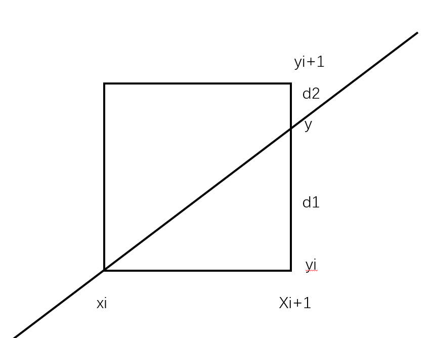
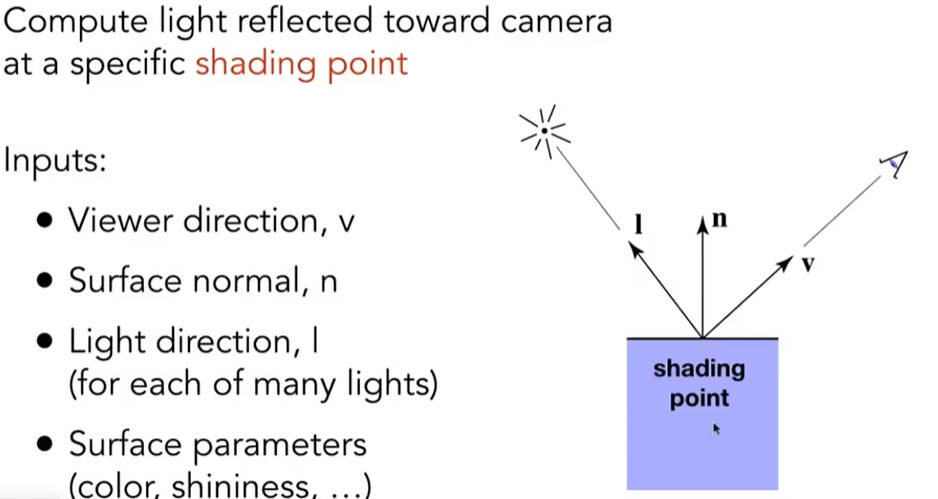
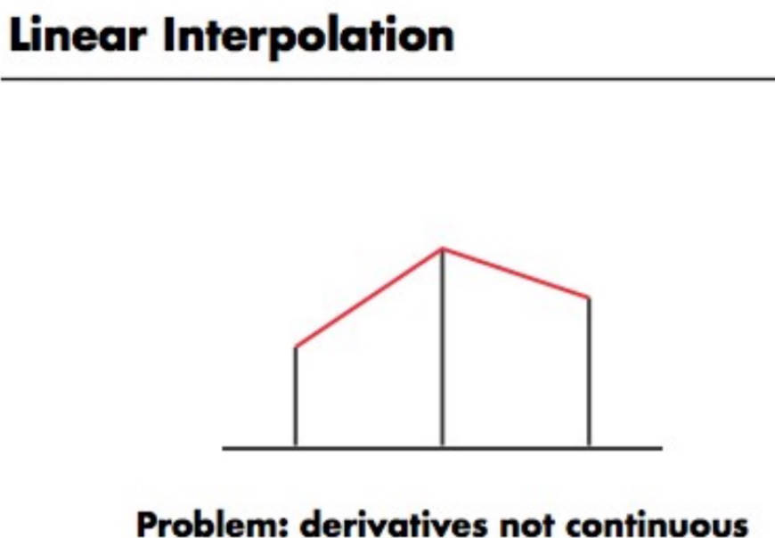
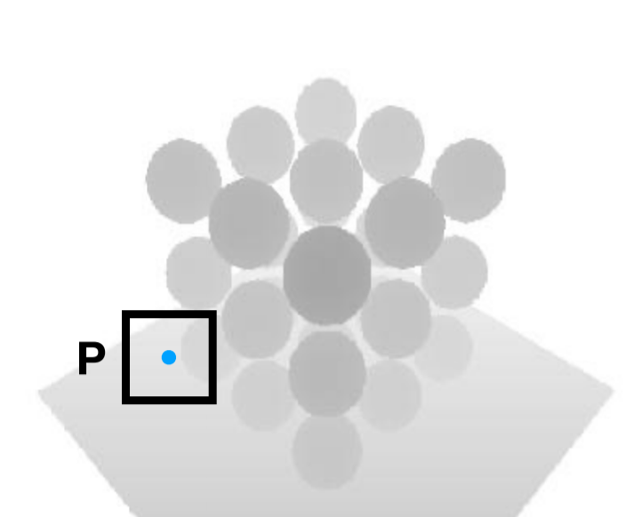
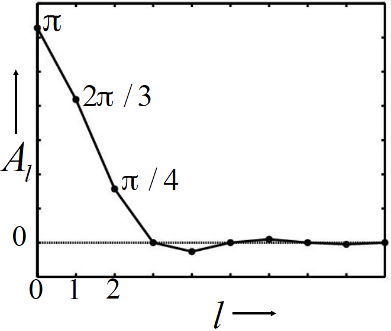
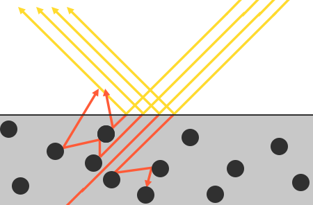
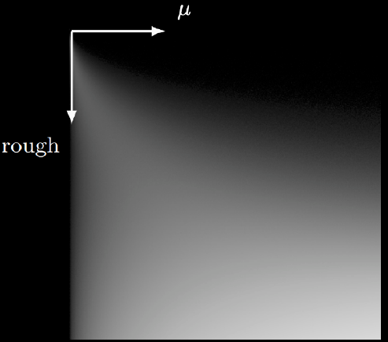
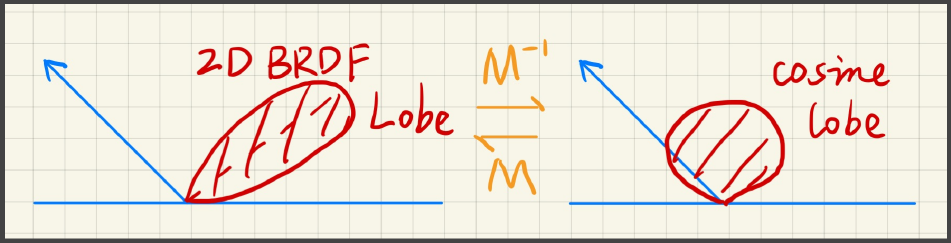
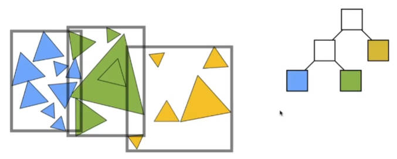
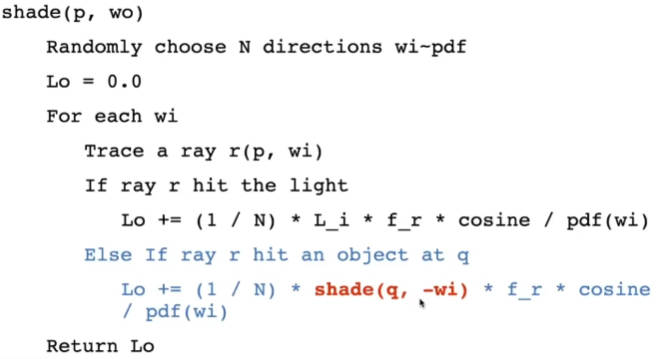

# 计算机图形学

[TOC]


## 线性代数


### 叉积在图形学中的应用

1. 判断左与右，算 $\overrightarrow{a}\times\overrightarrow{b}$，如果是正数，b 在 a 左侧，否则 b 在 a 右侧。
2. 判断 P 是否在三角形 ABC 内部：分别计算 $\overrightarrow{AP}\times\overrightarrow{AB},\ \ \ \ \overrightarrow{BP}\times\overrightarrow{BC},\ \ \ \ \overrightarrow{CP}\times\overrightarrow{CA}$，如果同号，那么P在ABC内部。如果为0，自己定义。


### 叉积转换

$$
\overrightarrow{a}\times\overrightarrow{b}=A\times b=
\left(
\begin{array}{cc}
0 & -z_a & y_a\\
z_a & 0 & -x_a\\
-y_a & x_a & 0
\end{array}
\right)\times
\left(
\begin{array}{cc}
x_b\\y_b\\z_b
\end{array}
\right)
$$


## 二维变换


### Scale

$$
\left[
\begin{array}{cc}
x'\\y'
\end{array}
\right]=
\left[
\begin{array}{cc}
s_x & 0\\
0 & s_y\\
\end{array}
\right]
\left[
\begin{array}{cc}
x\\y
\end{array}
\right]
$$


### Reflection(x axis)

$$
\left[
\begin{array}{cc}
x'\\y'
\end{array}
\right]=
\left[
\begin{array}{cc}
-1 & 0\\
0 & 1\\
\end{array}
\right]
\left[
\begin{array}{cc}
x\\y
\end{array}
\right]
$$


### Shear(x axis)

$$
\left[
\begin{array}{cc}
x'\\y'
\end{array}
\right]=
\left[
\begin{array}{cc}
1 & a\\
0 & 1\\
\end{array}
\right]
\left[
\begin{array}{cc}
x\\y
\end{array}
\right]
$$


### Rotate（默认以原点为中心，逆时针旋转旋转$\theta$）

$$
\left[
\begin{array}{cc}
x'\\y'
\end{array}
\right]=
\left[
\begin{array}{cc}
\cos\theta & -\sin\theta\\
\sin\theta & \cos\theta
\end{array}
\right]
\left[
\begin{array}{cc}
x\\y
\end{array}
\right]
$$


### 齐次坐标

1. 平移坐标系
   $$
   \left[
   \begin{array}{cc}
   x'\\y'
   \end{array}
   \right]=
   \left[
   \begin{array}{cc}
   a & b\\
   c & d\\
   \end{array}
   \right]
   \left[
   \begin{array}{cc}
   x\\y
   \end{array}
   \right]+
   \left[
   \begin{array}{cc}
   t_x\\t_y
   \end{array}
   \right]
   $$

2. 增加一个维度的表示

   1. 2D point
      $$
      \left[
      \begin{array}{cc}
      x'\\y'\\\omega'
      \end{array}
      \right]=
      \left[
      \begin{array}{cc}
      1 & 0 & t_x\\
      0 & 1 & t_y\\
      0 & 0 & 1
      \end{array}
      \right]
      \left[
      \begin{array}{cc}
      x\\y\\1
      \end{array}
      \right]=
      \left[
      \begin{array}{cc}
      x+t_x\\y+t_y\\1
      \end{array}
      \right]
      $$
      
   2. 2D vector
      $$
      \left[
      \begin{array}{cc}
      x'\\y'\\\omega'
      \end{array}
      \right]=
      \left[
      \begin{array}{cc}
      1 & 0 & t_x\\
      0 & 1 & t_y\\
      0 & 0 & 1
      \end{array}
      \right]
      \left[
      \begin{array}{cc}
      x\\y\\0
      \end{array}
      \right]=
      \left[
      \begin{array}{cc}
      x\\y\\0
      \end{array}
      \right]
      $$
      保证了向量具有平移不变性，并且保证了以下操作的意义
   
   - $vector+vector=vector$
   
   - $point-point=vector$
   
   - $point+vector=vector$
   
   - $point+point=midpoint$
     $$
     \left[
     \begin{array}{cc}
     x\\y\\\omega
     \end{array}
     \right]is\ 2D\ point\ 
     \left[
     \begin{array}{cc}
     x/\omega\\y/\omega\\1
     \end{array}
     \right]
     $$
   
3. 所有的仿射变换均可写作
   $$
   \left[
   \begin{array}{cc}
   x'\\y'\\1
   \end{array}
   \right]=
   \left[
   \begin{array}{cc}
   a & b & t_x\\
   c & d & t_y\\
   0 & 0 & 1
   \end{array}
   \right]
   \left[
   \begin{array}{cc}
   x\\y\\1
   \end{array}
   \right]
   $$


## 三维变换


### 齐次坐标

$3D\ point=(x,y,z,1)^T$

$3D\ vector=(x,y,z,0)^T$

$(x,y,z,w)^T=(x/w,y/w,z/w,1)^T$

3D 转换：
$$
\left[
\begin{array}{cc}
x'\\y'\\z'\\1
\end{array}
\right]=
\left[
\begin{array}{cc}
a & b & c & t_x\\
d & e & f & t_y\\
g & h & i & t_z\\
0 & 0 & 0 & 1
\end{array}
\right]
\left[
\begin{array}{cc}
x\\y\\z\\1
\end{array}
\right]
$$


### 转换

#### Scale

$$
\left[
\begin{array}{cc}
x'\\y'\\z'\\1
\end{array}
\right]=
\left[
\begin{array}{cc}
s_x & 0 & 0 & 0\\
0 & s_y & 0 & 0\\
0 & 0 & s_z & 0\\
0 & 0 & 0 & 1
\end{array}
\right]
\left[
\begin{array}{cc}
x\\y\\z\\1
\end{array}
\right]
$$


#### Reflection(x axis)

$$
\left[
\begin{array}{cc}
x'\\y'\\z'\\1
\end{array}
\right]=
\left[
\begin{array}{cc}
-1 & 0 & 0 & 0\\
0 & 1 & 0 & 0\\
0 & 0 & 1 & 0\\
0 & 0 & 0 & 1
\end{array}
\right]
\left[
\begin{array}{cc}
x\\y\\z\\1
\end{array}
\right]
$$


#### Shear(x axis)

$$
\left[
\begin{array}{cc}
x'\\y'\\z'\\1
\end{array}
\right]=
\left[
\begin{array}{cc}
1 & a & b & 0\\
0 & 1 & 0 & 0\\
0 & 0 & 1 & 0\\
0 & 0 & 0 & 1
\end{array}
\right]
\left[
\begin{array}{cc}
x\\y\\z\\1
\end{array}
\right]
$$


#### Rotate（默认以原点为中心，逆时针旋转旋转$\theta$）

1. 绕 x 轴
   $$
   \left[
   \begin{array}{cc}
   x'\\y'\\z'\\1
   \end{array}
   \right]=
   \left[
   \begin{array}{cc}
   1 & 0 & 0 & 0\\
   0 & \cos\alpha & -\sin\alpha & 0\\
   0 & \sin\alpha & \cos\alpha & 0\\
   0 & 0 & 0 & 1
   \end{array}
   \right]
   \left[
   \begin{array}{cc}
   x\\y\\z\\1
   \end{array}
   \right]
   $$

2. 绕 y 轴
   $$
   \left[
   \begin{array}{cc}
   x'\\y'\\z'\\1
   \end{array}
   \right]=
   \left[
   \begin{array}{cc}
   \cos\alpha & 0 & \sin\alpha & 0\\
   0 & 1 & 0 & 0\\
   -\sin\alpha & 0 & \cos\alpha & 0\\
   0 & 0 & 0 & 1
   \end{array}
   \right]
   \left[
   \begin{array}{cc}
   x\\y\\z\\1
   \end{array}
   \right]
   $$

3. 绕 z 轴
   $$
   \left[
   \begin{array}{cc}
   x'\\y'\\z'\\1
   \end{array}
   \right]=
   \left[
   \begin{array}{cc}
   \cos\alpha & -\sin\alpha & 0 & 0\\
   \sin\alpha & \cos\alpha & 0 & 0\\
   0 & 0 & 1 & 0\\
   0 & 0 & 0 & 1
   \end{array}
   \right]
   \left[
   \begin{array}{cc}
   x\\y\\z\\1
   \end{array}
   \right]
   $$

4. 任何一个三维旋转都可以分解为 xyz 轴上的绕轴旋转。

5. Rodrigues' Rotation Formula
   $$
   R(n,\alpha)=\cos(\alpha)I+(1-\cos(\alpha))nn^T+\sin(\alpha)
   \left(
   \begin{array}{cc}
   0 & -n_z & n_y\\
   n_z & 0 & -n_x\\
   -n_y & n_x & 0
   \end{array}
   \right)
   $$
   其中，$n$ 是以原点为起点，n 为方向的一个矢量。


### 视图变换

三个参数：

- 位置 $\vec{e}$
- Look-at direction $\vec{g}$
- 上方向 $\vec{t}$


为了操作简化，我们将相机放置在坐标原点，并且摄像机始终朝向 -z 方向(up at y, look at -z)

1. 平移回坐标原点
   $$
   T_{view}=
   \left[
   \begin{array}{cc}
   1 & 0 & 0 & -x_e\\
   0 & 1 & 0 & -y_e\\
   0 & 0 & 1 & -z_e\\
   0 & 0 & 0 & 1
   \end{array}
   \right]
   $$

2. $\overrightarrow{g}\ to\ -Z,\ \overrightarrow{t}\ to\ Y$

   反过来转换，z轴旋转到-g，y轴旋转到t，x轴旋转到$g\times t$
   $$
   R_{view}^{-1}=
   \left[
   \begin{array}{cc}
   x_{g\times t} & x_t & x_{-g} & 0\\
   y_{g\times t} & y_t & y_{-g} & 0\\
   z_{g\times t} & z_t & z_{-g} & 0\\
   0 & 0 & 0 & 1
   \end{array}
   \right]
   \\
   R_{view}={R_{view}^{-1}}^T=
   \left[
   \begin{array}{cc}
   x_{g\times t} & y_{g\times t}& z_{g\times t} & 0\\
   x_t & y_t & z_t & 0\\
   x_{-g} & y_{-g} & z_{-g} & 0\\
   0 & 0 & 0 & 1
   \end{array}
   \right]
   $$
   因为旋转矩阵是正交矩阵，所以旋转矩阵的逆就是他的转置。

3. 整体变换
   $$
   M=RT
   $$
   


### 投影变换

#### 正交投影

更多用于工程制图，没有近大远小。

简单思路：

1. 将相机放置在默认位置。
2. 删除 z 坐标。
3. 移动并且缩放到 $[-1,1]^2$。

正规做法：我们想把一个 $[l,r]\times[b,t]\times[f,n]$ 的立方体变换到 $[-1,1]^3$，注意此时的坐标系，越远 z 越小，x、y 越大。因此在类似 OpenGL 的 API中，采用的是左手系。


$$
M_{ortho}=
\left[
\begin{array}{cc}
\frac{2}{r-l} & 0 & 0 & 0\\
0 & \frac{2}{t-b} & 0 & 0\\
0 & 0 & \frac{2}{n-f} & 0\\
0 & 0 & 0 & 1
\end{array}
\right]
\left[
\begin{array}{cc}
1 & 0 & 0 & -\frac{r+l}{2}\\
0 & 1 & 0 & -\frac{t+b}{2}\\
0 & 0 & 1 & -\frac{n+f}{2}\\
0 & 0 & 0 & 1
\end{array}
\right]
$$
全部投影到正则正方体后，还需要进行变换。

#### 透视投影


原理：（规定：近平面永远不变，z 轴的坐标不会发生缩放，中点不变）


在 x、y 轴进行缩放：$y'=\frac{n}{z}y,\ \ \ \ x'=\frac{n}{z}x$
$$
\left(
\begin{array}{cc}
x\\y\\z\\1
\end{array}
\right)
\rightarrow
\left(
\begin{array}{cc}
\frac{nx}{z}\\\frac{ny}{z}\\?\\1
\end{array}
\right)
\rightarrow
\left(
\begin{array}{cc}
nx\\ny\\?\\z
\end{array}
\right)
$$
带入近点和远点：
$$
An+B=n^2\\
Af+B=f^2\\
\therefore A=n+f\ \ \ \ B=-nf
$$

$$
M_{persp\rightarrow ortho}=
\left(
\begin{array}{cc}
n & 0 & 0 & 0\\
0 & n & 0 & 0\\
0 & 0 & n+f & -nf\\
0 & 0 & 1 & 0
\end{array}
\right)
$$


## Rasterization


### 定义一个视锥

1. aspect ratio = width / height，以及一个垂直的可视角度。


### Canonical Cube to Screen

Raster = Screen in German

Rasterize = Drawing onto the screen


- Irrelevant to z

- Transform in xy plane: $[-1,1]^2$ to $[0,width]\times[0,height]$
  $$
  M_{viewport}=
  \left(
  \begin{array}{cc}
  \frac{width}{2} & 0 & 0 & \frac{width}{2}\\
  0 & \frac{height}{2} & 0 & \frac{height}{2}\\
  0 & 0 & 1 & 0\\
  0 & 0 & 0 & 1
  \end{array}
  \right)
  $$
  


### Drawing to Raster Displays

#### Sampling

是否像素中心在三角形内


$$
inside(t,x,y)=
\left\{
\begin{array}{rcl}
1&Point(x,y)\ in\ rectangle\ t\\
0&otherwise
\end{array}
\right.
$$

```c
for (int x = 0; x < xmax; x++){
    for (int y = 0; y < ymax; y++){
        image[x][y] = inside(tri, x + 0.5, y + 0.5);
    }
}
```

加速方法：

axis aligned bounding box（包围盒）


问题：锯齿问题(Aliasing)


### Drawing Graphics

#### 直线

假设直线的两端$(x_1,y_1)$、$(x_2,y_2)$都是整数。


$$
\begin{flalign}
& We\ know\ that\\
& y=mx+b\\
& d_1=y-y_i\\
& d_2=y_i+1-y\\
& d_x=x_2-x_1\\
& d_y=y_2-y_1\\
& m=d_y/d_x\\
\\
&\rightarrow judge\ d_1\ and\ d_2\\
\\
& d_1-d_2\\
& =2y-2y_i-1\\
& =2m(x_i+1)+2b-2y_i-1\\
& =2d_y/d_x\times x_i+2d_y/d_x+2b-2y_i-1\\
\\
& let\ P_i=(d_1-d_2)\times d_x\\
& P_i=2d_y x_i+2d_y+(2b-1)d_x-2y_i d_x\\
& P_{i+1}\\
& =2d_y x_{i+1}+2d_y+(2b-1)d_x-2y_{i+1} d_x\\
& =2d_y (x_i+1)+2d_y+(2b-1)d_x-2y_{i+1} d_x\\
& =P_i+2d_y-2(y_{i+1}-y_i)d_x\\
\\
& if\ Pi\gt0,\ then\ y_{i+1}=y_i+1,otherwise\ y_{i+1}=y_i\\
& P_{i+1}=P_i+2d_y-(P_i\gt0)?2d_x:0\\
& P_0= d_x（可以理解为d_1=1,d_2=0,(d_1-d_2)d_x=d_x）

\end{flalign}
$$


#### 椭圆

$b^2x^2+a^2y^2-a^2b^2=0$


1. 画第一象限，然后通过对称的方式画其他。

   

2. x变化大于y变化和x变化小于y变化临界点: $x=\sqrt{\frac{a^4}{a^2+b^2}},\ y=\sqrt{\frac{b^4}{a^2+b^2}}$

   

3. 在x变化大于y变化时：

   
   $$
   \begin{align}
   
   &y_{i+1}=
   \left\{
   \begin{array}{rcl}
   &y_i&d_{1i}\lt0\\
   &y_i-1&d_{1i}\ge0\\
   \end{array}
   \right.\\\\
   
   &d_{1i}=b^2(x_i+1)^2+a^2(y_i-0.5)^2-a^2b^2\\
   \\
   &当d_{1i}\lt0时，下一步的中点为(x_i+2,y_i-0.5)\\
   &d_{1(i+1)}=b^2(x_i+2)^2+a^2(y_i-0.5)^2-a^2b^2\\
   &\ \ \ \ \ \ \ \ \ \ \ =d_{1i}+2b^2x_i+3b^2\\
   \\
   &当d_{1i}\ge0时，下一步的中点为(x_i+2,y_i-1.5)\\
   &d_{1(i+1)}=b^2(x_i+2)^2+a^2(y_i-1.5)^2-a^2b^2\\
   &\ \ \ \ \ \ \ \ \ \ \ =d_{1i}+2b^2x_i+3b^2-2a^2y_i+2a^2\\
   \\
   &因此，d_{1(i+1)}=d_{1i}+2b^2x_i+3b^2+(d_{1i}\ge0)?(2a^2-2a^2y_i):0\\
   &d_{10}=b^2(1)^2+a^2(b-0.5)^2-a^2b^2=b^2-a^2b+a^2/4\\
   &同时乘4让d为整形
   \end{align}
   $$
   
4. 过渡

   $b^2x^2+a^2y^2-a^2b^2=0$

   在$(x,y)$的法向量为$2b^2x\ \overrightarrow{i}+2a^2y\ \overrightarrow{j}$，因此边界为$2b^2x=2a^2y$时候。

   

5. 当y的变化大于x变化时：

   
   $$
   \begin{align}
   
   &x_{i+1}=
   \left\{
   \begin{array}{rcl}
   &x_i+1&d_{2i}\lt0\\
   &x_i&d_{2i}\ge0\\
   \end{array}
   \right.\\\\
   
   &d_{2i}=b^2(x_i+0.5)^2+a^2(y_i-1)^2-a^2b^2\\
   \\
   &当d_{2i}\lt0时，下一步的中点为(x_i+1.5,y_i-2)\\
   &d_{2(i+1)}=b^2(x_i+1.5)^2+a^2(y_i-2)^2-a^2b^2\\
   &\ \ \ \ \ \ \ \ \ \ \ =d_{2i}+2b^2x_i+2b^2+3a^2-2a^2y_i\\
   \\
   &当d_{2i}\ge0时，下一步的中点为(x_i+0.5,y_i-2)\\
   &d_{2(i+1)}=b^2(x_i+0.5)^2+a^2(y_i-2)^2-a^2b^2\\
   &\ \ \ \ \ \ \ \ \ \ \ =d_{2i}+3a^2-2a^2y_i\\
   \\
   &因此，d_{2(i+1)}=d_{2i}+3a^2-2a^2y_i+(d_{2i}\ge0)?0:(2b^2x_i+2b^2)\\
   &同时乘4让d为整形
   \end{align}
   $$


### 反走样(Antialiasing)

#### 采样理论(Sample)

1. Nyquist-Shannon sampling problem: 如果一个系统以超过信号最高频率至少两倍的速率对模拟信号进行均匀采样，那么原始模拟信号就能从采样产生的离散值中完全恢复。

1. Sample artifacts（瑕疵）

   1. 锯齿

   2. 摩尔纹(Moire Patterns)，去掉奇数行和奇数列，会产生纹路

      

   3. 车轮效应，因为刷新率和旋转速度的关系导致某些物体倒着转

#### 抗锯齿实践

1. 模糊操作再进行采样

2. 计算像素平均值（MSAA）

   

   方法一：超采样（super-sampling），然后计算像素平均值

   

   方法二：面积采样（area-sampling）

3. FXAA

4. TAA


### 画多个三角形

#### 画家算法

从远到近，将三角形一个一个光栅化。时间复杂度为$O(n\log n)$，并且有些情况无法定义深度关系。


#### 深度缓存（Z-Buffer）

对每个像素找最近的三角形。在渲染出一张图像的同时，我们会记录这张图中每个像素最浅的信息。这张图叫做深度图或者深度缓存。


```pseudocode
initialize depth to be infinite

for (each triangle T)
	for (each sample (x,y,z) in T)
		if (z < zbuffer(x,y))
			framebuffer(x,y)=rgb
			zbuffer(x,y)=z
```


时间复杂度：$O(n)$，并且和绘画顺序无关。


## Shading


### Definition

The process of applying a material to an object.（对不同物体应用不同的材质）


### A Simple Shading Model(Blinn-Phong Reflectance Model)


#### Shading is local



但是阴影不会生成，着色不考虑其他任何物体的存在。


#### Diffuse Reflection

不同角度的光线照射到同一个物体上亮度不一样。


将某一时刻光的能量分散在一个球壳上，假设距离光源 1 的光照强度为 $I$，那么距离 r 的光照强度为 $\frac{I}{r^2}$。

$L_d(diffuse\ reflected\ light)=k_d(diffuse\ coefficient)(I/r^2)max(0,n\cdot l)$


#### Specular Term


观察方向和镜面反射方向接近时就能看到高光。并且此时法向量和半程向量接近。


$L_s=k_s(I/r^2)max(0,n\cdot h)^p$，此时 $k_s$ 一般为白色。

p 指数解释：缩小高光面积。


#### Ambient Term


#### Blinn-Phong Reflection Model


### Shading Frequencies(着色频率)


将着色应用在哪些点上的问题。


#### Shade each triangle(flat shading)

对每个三角形做一个叉积求得法线。


#### Shade each vertex(Gouraud shading)

求出每个顶点的法线，对每个顶点着色，然后通过插值的方式对三角形内进行插值。

求顶点法线：如果知道直接求，如果不知道求以其为顶点的所有三角形法线的平均值。也可以是三角形面积的加权平均。


#### Shade each pixel(Phong shading)

对每个像素进行着色。


#### 比较


当模型很精确、很复杂的时候，可以采用较为简单的着色方式。着色方式取决于具体的物体。


### Graphics(Real-time Rendering) Pipeline（实时渲染管线）


#### 从实时场景到一张图的管线（Pipeline）


#### Shader

现代 GPU 定义了一系列着色顶点或者像素的办法，shader 是能在硬件上执行的语言。如果是在顶点上着色，那么这个着色器就叫做 vertex shader，如果实在像素上着色，那么就是 fragment shader/pixel shader


### Texture mapping（纹理映射）

虽然公用同一个着色模型，但是不同地方漫反射系数不同。


假设已知物体映射到纹理的方式。

已知三角形三个顶点在纹理上的坐标u和v，如何定位三角形内部的某个坐标。


#### Barycentric Coordinates（重心坐标）

三角形内任意一点都可以表示为顶点的线性组合：$(x,y)=\alpha A+\beta B+\gamma C,\ \ \ \ \alpha+\beta+\gamma=1,\ \ \ \ \alpha\ge0,\ \beta\ge 0,\ \gamma\ge 0$


已知$(x_A,y_A),(x_B,y_B),(x_C,y_c),(x,y)$，求$\alpha,\beta,\gamma$。


用中心坐标做颜色插值


缺点：重心坐标并非在投影下不变，真要找的话需要点在三维空间下的坐标。


#### Applying Textures

1. Simple Texture Mapping: Diffuse color

   ```pseudocode
   for each rasterized sample (x,y):
   	(u,v) = evaliate texture coordinate at (x,y)
   	texcolor = texture.sample(u,v)
   	set sample's color to texcolor(kd)
   ```

   problem 1: Texture Magnification

   纹理太小，纹理放大而造成模糊

   solve: Nearest->Bilinear interpolation（双线性插值）->Bicubic（双三次插值）

   纹理太大，经过缩小而造成损失

   Mipmap: Allowing(fast,approx,square) range queries

   

   Level 1 - Level 7的总存储量只有Level 0的$\frac{1}{3}$左右。

   

   

   

   mipmap存在的问题：overblur，过度模糊，解决方法：各向异性过滤。

   


2. 纹理可以被用来表示环境光

   

   Spherical Environment Map：将整个环境光记录在一个球上，但是展开时会出现扭曲。解决方法：映射到一个立方体上。

   

   

3. 纹理可以定义相对高度

   

   

Bump mapping：对任意像素的法线做一个扰动。

Displacement mapping（位移贴图）：会真的做位置的移动


## Geometry


### 分类

1. 隐式几何（Implicit geometry）

   不会告诉每个点在哪里，但是会给出分布规律。比如$x^2+y^2+z^2=1$。通式为$f(x,y,z)=0$。

   好处：容易判断一个点是否落在这个曲线上。

   缺点：不好找出落在曲线上的所有点。

   显示曲线：网格细分，但是存在采样率不足的问题。

   

2. 显式几何（Explicit geometry）

   把三角形的所有顶点记录下来或者把平面$u,v$中的一个图形映射到三维上。如$y=x^2+5x+3$

3. 参数化曲线

   $x=x(t)\\y=y(t)\\z=z(t)$


### 隐式几何的表示

1. Constructive Solid  Geometry（CSG）

   

2. Distance Functions

   对任何一个几何，我们不描述表面，而描述任何一个点到这个表面的最近距离。

3. Fractals（分形）


### 显示几何的表示

1. Point Cloud（点云）：只要将点表示得足够细，就看不出来。

2. Polygon Mesh（多边形面，尤其是三角形）


### 参数曲线的表示

#### 插值

1. Nearest Neighbor Interpolation

   

2. Linear Interpolation

   

3. 分段三次埃尔米特插值

   假设三次多项式为P，并且已知$P(0),P'(0),P(1),P'(1)$，求P
   $$
   \begin{align}
   & P(t)=at^3+bt^2+ct+d\\
   & P'(t)=3at^2+2bt+c\\
   & P(0)=h_0=d\\
   & P(1)=h_1=a+b+c+d\\
   & P'(0)=h_2=c\\
   & P'(1)=h_3=3a+2b+c\\
   &\left[\begin{array}{cc}
   h_0\\h_1\\h_2\\h_3
   \end{array}\right]
   =\left[\begin{array}{cc}
   0&0&0&1\\1&1&1&1\\0&0&1&0\\3&2&1&0
   \end{array}\right]
   \left[\begin{array}{cc}
   a\\b\\c\\d
   \end{array}\right]\\
   & \left[\begin{array}{cc}
   a\\b\\c\\d
   \end{array}\right]
   =\left[\begin{array}{cc}
   2&-2&1&1\\-3&3&-2&-1\\0&0&1&0\\1&0&0&0
   \end{array}\right]\left[\begin{array}{cc}
   h_0\\h_1\\h_2\\h_3
   \end{array}\right]\\
   & P(t)=\left[\begin{array}{cc}
   a&b&c&d
   \end{array}\right]
   \left[\begin{array}{cc}
   t^3\\t^2\\t\\1
   \end{array}\right]=
   \left[\begin{array}{cc}
   h_0&h_1&h_2&h_3
   \end{array}\right]
   \left[\begin{array}{cc}
   H_0(t)\\H_1(t)\\H_2(t)\\H_3(t)
   \end{array}\right]\\
   &=\left[\begin{array}{cc}
   a&b&c&d
   \end{array}\right]
   \left[\begin{array}{cc}
   0&1&0&3\\0&1&0&2\\0&1&1&1\\1&1&0&0
   \end{array}\right]\left[\begin{array}{cc}
   H_0(t)\\H_1(t)\\H_2(t)\\H_3(t)
   \end{array}\right]\\
   & \therefore \left[\begin{array}{cc}
   t^3\\t^2\\t\\1
   \end{array}\right]=
   \left[\begin{array}{cc}
   0&1&0&3\\0&1&0&2\\0&1&1&1\\1&1&0&0
   \end{array}\right]
   \left[\begin{array}{cc}
   H_0(t)\\H_1(t)\\H_2(t)\\H_3(t)
   \end{array}\right]\\
   & \therefore \left[\begin{array}{cc}
   H_0(t)\\H_1(t)\\H_2(t)\\H_3(t)
   \end{array}\right]=
   \left[\begin{array}{cc}
   2&-3&0&1\\-2&3&0&0\\1&-2&1&0\\1&-1&0&0
   \end{array}\right]
   \left[\begin{array}{cc}
   t^3\\t^2\\t\\1
   \end{array}\right]\\
   & \therefore P(t)=P(0)\times(2T^3-3t^2+1)+P(1)\times(-2t^3+3t^2)+\\&P'(0)\times(t^3-2t^2+t)+P'(1)\times(t^3-t^2)\\
   \end{align}
   $$

4. Catmull-Rom Interpolation

   


#### 贝塞尔曲线

1. Bezier Curves（贝塞尔曲线）
   $$
   \begin{align}
   & C(t)=\Sigma_{i=0}^nP_iB_{i,n}(t),\ t\in[0,1]\\
   & B_{i,n}(t)=C_n^it^i(1-t)^{n-i},\ t\in[0,1]\\
   & B_{i,n}(0)=\left\{
   \begin{array}{rcl}
   1,\ i=0\\0,\ else
   \end{array}\right.\\
   & B_{i,n}(1)=\left\{
   \begin{array}{rcl}
   1,\ i=n\\0,\ else
   \end{array}\right.\\
   & C(0)=P_0,\ C(1)=P_n\\
   & C'(t)=n\Sigma_{i=0}^{n-1}(P_{i+1}-P_{i})B_{i,n-1}(t)
   ,\ t\in[0,1]\\
   \end{align}
   $$
   性质：对称性、仿射变换不变性、闭合性

   

   起点在p0，终点在p3，切线符合t0，t1。

   de Casteljau Algorithm：

   1. quadratic Bezier

      

   2. cubic Bezier

      

   3. piecewise Bezier

      几何上在一起：c0连续

      一阶导数相等：c1连续

   

2. Rational Bezier Curve
   $$
   R(t)=\frac{\Sigma_{i=0}^nB_{i,n}(t)w_iP_i}{\Sigma_{i=0}^nB_{i,n}(t)w_i}
   $$
   

3. 贝塞尔曲面

   

4. B-样条插值（B-splines）

   贝塞尔曲线的缺点是其影响是全局的变动一个点整个曲线都要变。


### Mesh operations

#### Mesh subdivision（网格细分）

1. loop subdivision

   

   更新新加顶点的位置

   

   更新旧顶点的位置

   

2. Catmull-Clark Subdivision（loop方法只适用于三角形，这个算法更适用于一般的）

   

   奇异点是指度不为4的点。每一条边都取一个中点，每个面也取中间的一个点，然后边上的和面上的点连起来。

   

   在一次细分之后，所有面都变为四边形，之后奇异点的数目不会再增加了。

   更新算法：

   

   

#### Mesh simplification（网格简化）

1. Collapsing an edge（边坍缩）

   找到一条边，将边两边的顶点“捏”在一起。

   哪些边要坍缩，哪些边不能坍缩：

   Quadric Error Metrics：将点放在一个位置上，使得二次误差最小。

   

   从二次误差最小的边开始坍缩。

   

#### Mesh regularization（网格正规化）

将一些非常细长的三角形正规化为形状比较规则的三角形。


## Shadows


### Shadow Mapping

两次渲染：

- 从光源角度看一次场景并且输出一个深度图（Shadow Map）。
- 从摄像机视角渲染一次并通过 Shadow Map 比较深度。


这样做的好处是只需要 Shadow Map 而不需要实际场景。

坏处是有

1. 自遮挡现象（Self Occlusion）

   产生原因是 Shadow Map 是离散的，因此一个场景中一个区域对光源的距离都是一个常数。但是和眼睛看到的一个点的深度可能就产生了偏差。

   

   解决方法是：

   1. 允许一定的深度误差，但是距离地面很近的物体可能无法产生阴影（Detached Shadow）。

   2. 用最小深度和第二小深度取中间值作为 Shadow Map。（实际上没人用）

      

2. 走样锯齿（Aliasing）

   因为阴影有一定的分辨率，所以就会产生锯齿。


### Shadow Mapping 的数学原理

$$
\begin{align}
& Schwarz 不等式：[\int_a^bf(x)g(x)dx]^2\le\int_a^bf^2(x)dx\cdot\int_a^bg^2(x)dx\\
& Minkowski 不等式：[\int_a^b[f(x)+g(x)]^2dx]^\frac{1}{2}\le[\int_a^bf^2(x)dx]^\frac{1}{2}+[\int_a^bg^2(x)dx]^\frac{1}{2}\\
& 实时渲染常用的约等式：\int_\Omega f(x)g(x)dx\approx \frac{\int_\Omega f(x)dx}{\int_\Omega dx}\cdot \int_\Omega g(x)dx\\
& 只要其中一个函数积分域小(Small\ support)或者变化不大就能近似\\
& \\
& \therefore L_o(p,\omega_o)=\int_{\Omega+}L_i(p,\omega_i)f_r(p,\omega_i,\omega_o)\cos \theta_i V(p,\omega_i)d\omega_i\\
& \approx \frac{\int_{\Omega+}V(p,\omega_i)d\omega_i}{\int_{\Omega+}d\omega_i}\int_{\Omega+}L_i(p,\omega_i)f_r(p,\omega_i,\omega_o)\cos \theta_i d\omega_i\\
& 对于点光源或者是方向光源，这个等式是准确的；\\
& 等亮的面光源或者渲染的材质是 diffuse 也是准确的。
\end{align}
$$


### Percentage Closer Soft Shadows

Percentage Closer Filtering（PCF）：PCF 是用来原本处理抗锯齿的，人们之后发现可以用 PCF 来做软阴影。PCF 既没有对图像做平滑，也没有对 Shadow Map 做平滑。

具体做法是生成 Shadow Map 后，对于每一个摄像机看到的点，去查找 Shadow Map 中对应点周围一圈像素点的深度，然后一一比较深度得到一个 0，1 矩阵，最后求平均得到一个浮点数。



阴影的软硬很大程度上由阴影与遮挡物之间的距离决定，距离越小阴影越硬，filter size 就越小。


$$
w_{Penumbra}=(d_{Receiver}-d_{Blocker})\cdot w_{Light} / d_{Blocker}
$$
算法步骤：

1. Blocker Search：从这个点到光源连线，获取周围一圈的 Blocker，然后计算平均的深度 $d_{Blocker}$。
2. Penumbra Estimation：计算 filter 的大小。
3. 使用 PCF。

其中第一步用来估计 Blocker Depth 的大小可以用常数，也可以用以下方法确定：


可以看 Shading point 连向光源的锥体在近平面上覆盖了多大的区域。


#### PCSS 改进

工业界的做法是在第一步或者第三步都进行稀疏采样，这样做出来的阴影会有噪声和抖动，可以使用时间域和空间域上降噪解决。


### Variance Soft Shadow Mapping

VSSM 针对性解决 PCSS 第一部和第三步慢的问题。


#### 第三步改进

为了做第三步的 PCF，PCSS 需要遍历所有的深度来确定自己深度的排位，以此计算遮挡物的百分比。但是我们也可以通过快速计算深度的平均和方差来计算遮挡物百分比。

- 计算平均值有以下方式：

  - MIPMAP，但是 MIPMAP 只能计算正方形区域。

  - Summed Area Tables（SAT）

    SAT 中一个像素点的值是原图该点到左上角围成矩形的所有像素点的值的和，要计算某一个矩形值只需要 $f(右下)-f(右上)-f(左下)+f(左上)$ 即可。

- 方差使用公式
  $$
  Var(X)=E(X^2)-E^2(X)
  $$
  因此在生成 Shadow Map 的同时可以顺便计算方差。

- 假设是正态分布/高斯分布，已经得到均值和方差，我们可以计算 CDF 。该方程没有解析解，但是有数值解叫 error function，C++ 调用 erf。

  除此之外，根据切比雪夫不等式：
  $$
  P(x\gt t)\le \frac{\sigma^2}{\sigma^2+(t-\mu)^2}(t\gt \mu)\\
  t\lt \mu 的情况同样近似即可
  $$
  任何分布均满足这个规律，我们可以将这个不等式当作一个约等式来看。


#### 第一步改进

为了做第一步，PCSS 需要遍历 Shadow Map 上对应区域的遮挡物的平均深度。

假设整个区域的平均深度是 $z_{avg}$，遮挡物的平均深度是 $z_{occ}$，非遮挡物的平均深度是 $z_{unocc}$，因此
$$
\frac{N_{occ}}{N}z_{occ}+\frac{N_{unocc}}{N}z_{unocc}=z_{avg}
$$
其中
$$
\frac{N_{occ}}{N}=P(x\gt t)
$$
因此同样可以使用切比雪夫不等式，并且认为非遮挡物的平均遮挡物可当前的 Shading Point 的深度一样。


#### 注意 

- 一旦物体或者光源移动需要重新生成 MIPMAP 或者 SAT 等信息。
- 因为图像上的降噪很好，所以 PCSS + 稀疏采样更多地被采纳。


### Moment Shadow Mapping

VSSM 的问题是太多的假设和近似使得采样会不准确。Moment Shadow Mapping 希望使用 moments 来更准确地描述分布。

比如对于 $x$，$x,x^2,x^3,\cdots$ 都是 moments（矩），VSSM 只用了前两阶的矩。$m$ 阶的矩能表示 $m/2$ 的阶。


### Signed Distance Field

有向距离场（Signed Distance Field，SDF）：这个场是由空间中的点到某个物体表面的最短有向距离组成的，通常，在物体内的点到物体表面的距离为正，在物体外的点到物体表面的距离为负（也可以相反）。


#### Ray marching

光线追踪使用有向距离场看光线打到物体的哪一个地方。


已知 SDF 以及一个光线的方向，那么对于 $P_0$ ，我们知道他到场景的最小距离 $r_0$，那么在以 $P_0$ 为球心，$r_0$ 为半径的球内不会存在任何物体。因此可以得到光线和这个球的焦点 $P_1$，对 $P_1,P_2,\cdots$ 执行同样步骤，知道某个点的 $SDF$ 小于某个值或者光线走得足够远。

SDF 可以运用于运动的物体，假设有多个物体的 SDF，在某一点只需要求这几个 SDF 中距离的最小值即可。


#### Distance Field Soft Shadows

通常来说，当要计算某点 p 的阴影信息时，我们可以通过 p 朝着光源的方向进行 ray marching。如果找到一个相交，那么则是阴影。但是这样做只会产生硬阴影。


在 ray marching 的整个过程中，我们可以通过得到一个安全角，安全角越小被遮挡得越多，阴影颜色就越深。得到安全角的具体方式是找 $P_1,P_2,\cdots$ SDF球的切线与光线的最小夹角：


正常方式 $\theta$ 的计算方式为：
$$
\theta=\arcsin \frac{SDF(p)}{|op|}
$$
但是为了效率我们采用的计算方法为：
$$
\theta=\min(\frac{k\cdot SDF(p)}{|op|},1.0)
$$
$k$ 是一个超参数，$k$ 越大越早被 cut off，阴影也越硬，也可以根据光源大小动态计算。


## Environment Lighting


### Split Sum Approximation

当 BRDF 偏向镜面的时候 support 较小；当 BRDF 偏向粗糙的时候，函数较为平滑。因此可以使用近似：
$$
\int f(x)g(x)dx\approx\frac{\int f(x)dx}{\int dx} \int g(x)dx
$$
因此，BRDF 的函数可以写作：
$$
\begin{align}
& L_o(p,w_o)\\
& =k_d\frac{c}{\pi}\int_\Omega L_i(p,\omega_i)(n\cdot\omega_i)d\omega_i+k_s\int_\Omega f_r(p,w_i,w_o)L_i(p,\omega_i)(n\cdot\omega_i)d\omega_i\\
& \approx k_d\frac{c}{\pi}\int_\Omega L_i(p,\omega_i)(n\cdot\omega_i)d\omega_i+k_s\frac{\int_{\Omega}L_i(p,\omega_i) dw_i}{\int_{\Omega}dw_i}\int_{\Omega}f_r(p,w_i,w_o)(n\cdot w_i)dw_i
\end{align}
$$
这个方程可以通过预计算进行加速。

对于镜面反射部分：
$$
\frac{\int_{\Omega}L_i(p,\omega_i) dw_i}{\int_{\Omega}dw_i}\int_{\Omega}f_r(p,w_i,w_o)(n\cdot w_i)dw_i
$$
卷积的第一部分被称为预滤波环境贴图，是预先计算的环境卷积贴图，但这次考虑了粗糙度。因为随着粗糙度的增加，参与环境贴图卷积的采样向量会更分散，导致反射更模糊，所以对于卷积的每个粗糙度级别，我们将按顺序把模糊后的结果存储在预滤波贴图的 mipmap 中。这样对于不同粗糙等级，查询不同等级 mipmap 图中的一个点就行了。例如，预过滤的环境贴图在其 5 个 mipmap 级别中存储 5 个不同粗糙度值的预卷积结果，如下图所示，要用到任意模糊度的时候可以使用三线性插值。


第二部分同样可以预计算，我们首先将 $F$ 项拆出来：
$$
\begin{align}
& \int_{\Omega}f_r(p,w_i,w_o)(n\cdot w_i)dw_i\\
& =\int_{\Omega}\frac{DFG}{4(\omega_0\cdot n)(\omega_i\cdot n)}(n\cdot w_i)dw_i\\
& =\int_{\Omega}\frac{DG}{4(\omega_0\cdot n)(\omega_i\cdot n)}(F_0+(1-F_0)(1-w_o\cdot h)^5)(n\cdot w_i)dw_i\\
& =F_0\int_{\Omega}\frac{DG}{4(\omega_0\cdot n)(\omega_i\cdot n)}(1-(1-w_o\cdot h)^5)(n\cdot w_i)dw_i+\\
& \ \ \ \ \int_{\Omega}\frac{DG}{4(\omega_0\cdot n)(\omega_i\cdot n)}(1-w_o\cdot h)^5(n\cdot w_i)dw_i
\end{align}
$$
那么现在这个积分内部只剩下两个变量 $roughness$ 和入射角 $\cos\theta_i$，二维变量的预计算可以将结果存储在一张纹理中，从而减小实时计算的压力。


上面 2D 查找纹理的横坐标是入射角 $\cos\theta_i$，纵坐标是粗糙度 $roughness$。这个纹理存储了上述的两个部分的值。


### Shadow From Environment Lighting

- 环境光照的阴影问题就是多光源问题。意思就是基本上要给所有光源都进行一次 Shadow Map，基本上无法做到。
- 因为采样是盲目的，因此可能原本有遮挡的但是采样没有采样到遮挡的部分。

解决方案有：

- 选择最亮的地方（比如太阳）来生成阴影。
-  Real Time Ray Tracing。
- Precomputed Radiance Transfer，PRT。


### Precomputed Radiance Transfer


#### Spherical Harmonics（球面谐波函数）

球面谐波函数是一系列定义在球面上的二维基函数。


表达式为：
$$
\begin{align}
& y_l^m(\theta,\phi)=
\left \{
\begin{array}{lcl}
\sqrt{2}K_l^m\cos(m\phi)P_l^m(\cos\theta),&m\gt 0\\
\sqrt{2}K_l^m\sin(-m\phi)P_l^{-m}(\cos\theta),&m\lt 0\\
K_l^0P_l^0(\cos\theta),&m=0
\end{array}
\right.\\
& where\\
& P_l^m(x)=(-1)^m(1-x^2)^{m/2}\frac{d^m}{dx^m}(P_l(x))\\
& P_n(x)=\frac{1}{2^n\cdot n!}\frac{d^n}{dx^n}[(x^2-1)^n]\\
& K_l^m=\sqrt{\frac{(2l+1)}{4\pi}\frac{(l-|m|)!}{(l+|m|)!}}
\end{align}
$$
性质：

1. 正交性，一个基函数在另一个基函数上投影是 0，投影到自己结果是 1。

2. 前 $n$ 阶基函数个数为 $n^2$。

3. 如果我们有旋转操作 $R$，那么如果我们有一个定义在单位球面上的原函数 $f(s)$，假设旋转之后是 $g(s)$，那么：
   $$
   \begin{align}
   & g(s)=R(f(s))\\
   & g(s)=f(R(s))
   \end{align}
   $$
   这条性质的作用在于，当环境光旋转（或者模型旋转）的时候，通过简单地将矩阵变换作用在球谐系数上就可以获得新的环境光的球谐系数。

4. 假设两个球面函数 $a(s)$ 和 $b(s)$ 的乘积是 $c(s)$，那么 $c(s)$ 的球谐系数 $c_i$ 可以看作是 $b_i$ 经过变换 $\hat{a}$ 后的值：
   $$
   \begin{align}
   & c_i=\int c(s)y_i(s)ds\\
   & =\int a(s)[\Sigma_jb_jy_j(s)]y_i(s)ds\\
   & =\Sigma_jb_j\int a(s)y_j(s)y_i(s)ds\\
   & =\Sigma_jb_j\int [\Sigma_ka_ky_k(s)]y_j(s)y_i(s)ds\\
   & =\Sigma_j\Sigma_kb_ja_k\int y_k(s)y_j(s)y_i(s)ds\\
   & =\Sigma_j(\Sigma_ka_k\int y_k(s)y_j(s)y_i(s)ds)b_j\\
   & =\Sigma_j\ \widehat{a_ij}\ b_j
   \end{align}
   $$

对于任何一个函数 $f(x)$，我们可以用球谐函数的线性组合来表示：
$$
f(x)=\Sigma c_iB_i(x)
$$
求 $c_i$ 系数也很简单（可以看作求投影）：
$$
c_i=\int f(x)B_i(x) dx
$$
在恢复的时候，可以保留低频部分，舍去高频部分来近似。


#### Diffuse Shading Use SH

Diffuse BRDF 和对应半球的环境光照进行卷积，类似于低通滤波，因此可以用少量的球面谐波函数来近似光照。（一般来说三阶就行了）




#### Precomputed Radiance Transfer（Shadow and Shading Using SH）

BRDF 方程为：
$$
L_o(p,w_o)=\int_{\Omega+}Visible(w_i)L_i(p,\omega_i)f_r(p,w_i,w_o)(n\cdot w_i)dw_i
$$
其中 $Visible(w_i)$、$L_i(o,w_i)$、$f_r(p,w_i,w_o)(n\cdot w_i)$ 都是球面函数，$L_i(o,w_i)$ 称为 Lighting，$Visible(w_i)f_r(p,w_i,w_o)(n\cdot w_i)$ 称为 Light Transport。

假设场景中只有光照条件会发生变化，其他的都不会发生变化。那么我们可以用球谐函数拟合光照：
$$
L_i(p,w_i)\approx \Sigma c_iB_i(w_i)
$$
并且基于假设剩下部分 $Visible(w_i)f_r(p,w_i,w_o)(n\cdot w_i)$ 同样是可以预计算的。

1. 在 Diffuse 情况下：
   $$
   \begin{align}
   & L(w_o)=k_d\frac{c}{\pi}\int L(w_i)V(w_i)max(0,n\cdot w_i) dw_i\\
   & \approx k_d\frac{c}{\pi}\int \Sigma_jc_{p_j}B_{j}(w_i) \Sigma_kc_{q_k}B_{k}(w_i) dw_i\\
   & \approx k_d\frac{c}{\pi}\Sigma_j\Sigma_kc_{p_j}c_{q_k}\int B_{j}(w_i) B_{k}(w_i) dw_i\\
   & \approx k_d\frac{c}{\pi}\Sigma_j c_{p_j}c_{q_j}
   \end{align}
   $$
   其中 $c_{p_j}$ 是 $L(i)$ 在 $B_i(i)$ 上的投影，$c_{q_j}$ 是 Light Transport 在 $B_i(i)$ 上的投影，这些都是可以预计算的，但是代价就是场景物体不能动。

2. 在 Glossy 情况下：

   与 Diffuse 相比，Glossy 的 BRDF 需要两个方向（Diffuse 只需要一个方向，因为每一个方向都是两维，所以 Glossy 的 BRDF 是四维的）。
   $$
   \begin{align}
   & L(w_o)=\int L(w_i)V(w_i)f_r(w_i,w_o)max(0,n\cdot w_i) dw_i\\
   & \approx \int \Sigma_jc_{p_j}B_{j}(w_i) \Sigma_kc_{(q_k,w_o)}B_{k}(w_i) dw_i\\
   & \approx \int \Sigma_jc_{p_j}B_{j}(w_i) c_{(q_j,w_o)}B_{j}(w_i) dw_i\\
   & \approx \Sigma_jc_{p_j}c_{(q_j,w_o)}\\
   & \because c_{(q_j,w_o)}\ is\ 2-dimensional\\
   & \therefore c_{(q_j,w_o)}=\Sigma_kc_{q_k}B_k\\
   & \therefore L(w_o)\approx \Sigma_j(c_{p_j})\Sigma_k(c_{q_k}B_k)\\
   & \ \ \ \ \ \ \ \ \ \ \ \ \ \ \ =\Sigma_j\Sigma_k(c_{p_j}c_{q_k}B_k)
   \end{align}
   $$
   

   这样的话存储变为原来的平方倍，并且运算也从向量的点乘变为了向量与矩阵的乘法，计算量也会大大提升。

3. 旋转公式推导

   1. 问题描述：

      我们目前已经得到了环境光照的球谐表达式 $L(w_i)=\Sigma_jp_jB_j(w_i)$ 以及旋转矩阵 $R$，我们需要计算 $L'(w_i)=L(R^{-1}(w_i))=\Sigma_jq_jB_j(w_i))$。

   2. 性质：

      1. 假设有一个旋转 $R$，对原函数 $f(x)$ 的旋转 $R(f(x))$ 与直接旋转 $f(x)$ 的自变量是一样的，即：
         $$
         \begin{align}
         & R(f(x)) = f(R(x))\\
         \end{align}
         $$

      2. 除此之外，对每层 band 上的 SH coefficient，可以分别在上面进行旋转，并且这个旋转是线性变化。

   3. 公式：
      $$
      \begin{align}
      & \Sigma_jq_jB_j(w_i)=L(R^{-1}(w_i))=R^{-1}(L(w_i))=R^{-1}(\Sigma_jp_jB_j(w_i))\\
      & 对每一层\ l：\\
      & \Sigma_{m=-l}^lq_{l,m}B_{l,m}(w_i)=R^{-1}(\Sigma_{m=-l}^lp_{l,m}B_{l,m}(w_i))\\
      & =\Sigma_{m=-l}^lp_{l,m}R^{-1}(B_{l,m}(w_i))\\
      & =\Sigma_{m=-l}^lp_{l,m}\Sigma_{m=-l}^lr_{l,m}B_{l,m}(w_i)\\
      & \therefore q_{(2l+1\times1)}=M_{(2l+1\times2l+1)}p_{(2l+1\times1)}
      \end{align}
      $$
      因此每层新的球谐系数 $q$ 可以由旧的球谐系数 $p$ 经过线性变换得到。 $M$ 的一种快速解法为：对球谐函数上的某层 band $l$，该 band $l$ 上有一个 $2l+1$ 维的，由 SH coefficient 构成的向量，假设我们有 $2l+1$ 个任意的三维单位向量 $n$，旋转函数 $R$，能够返回该 band 上球谐投影系数的函数 $P$，根据上述两条性质存在一个该 band 上 SH coefficient vector 的旋转矩阵 $M$ 使得：
      $$
      MP(n_i)=P(R^{-1}(n_i)),i\in[-l, l]
      $$
      那么：
      $$
      M[P(n_{-l}),\cdots ,P(n_l)]=[P(R^{-1}(n_{-l})),\cdots,P(R^{-1}(n_l))]
      $$
      记 $A=[P(n_{-l}),\cdots ,P(n_l)]$，如果 $A$ 是可逆矩阵，那么：
      $$
      M=[P(R^{-1}(n_{-l})),\cdots,P(R^{-1}(n_l))]A^{-1}
      $$

   4. 具体实现流程如下所示：

      1. 首先, 对于第 $l$ 层 band，选取 $2l + 1$ 个单位向量 $n$，对所有的 $n$ 将 $n_i$ 在球谐上投影并取该 band 上的系数，即得到 $P(n_i)$。总计 $2l +1$ 个$2l +1$ 维向量 $P(n_i)$ 构成了我们需要的矩阵 $A$，并求出 $A^{−1}$。
      2. 其次，给定旋转 $R$，对所有 $n$ 依次做旋转 $R^{-1}(n_i)$、SH 投影取系数$P(R^{-1}(n_i))$。此时我们应该得到 $2l + 1$ 个 $2l + 1$ 维向量 $P(R^{-1}(n_i))$，这些向量构成了我们需要的矩阵 $S$。
      3. 接着，需求的方阵 $M = SA^{−1}$，用 $M$ 乘以原 band 上的 $SH\ coefficient\ vector$ 就可以得到旋转后该层 band 上的 SH 系数了。
      4. 最后，重复上述过程至待求的每一层 band 上，将结果重新拼接起来即可得到整个SH 系数旋转后的结果。

注意：

- 基于之前提到的 SH 的性质（3），光照贴图的旋转可以通过改变同阶基函数的系数来替代。
- PRT 无法描述高阶的情况，比如镜面反射（Specular），这种情况下需要使用其他的基函数或者直接采样。
- Transport 不管多复杂，都是可以预计算的。
- Wavelet 作为基函数高频效果更好，但是不太能支持光源旋转。


## Real Time Global Illumination

 

### 3D Space


#### Reflective Shadow Maps, RSM

Reflective Shadow Maps 是一个经典的全局光照解决方案，它的基本思想是先找到被光第一次照射到的表面，然后将这些被照射到的表面当作新的点光源来处理。从这个方法的名称可以看出，这里用到了 shadow map。事实上也很容易想到，通过 shadow map 就可以很容易地找到被光第一次照射到的表面，接下来每个被照到的像素就是一个虚拟的点光源用来照亮整个场景。

假设：所有的反射物体（次级光源）都是 diffuse 的。


$$
\begin{align}
& L_o(p,w_o)=\int_{\Omega_{patch}}L_i(p,w_i)V(p,w_i)f_r(p,w_i,w_o)\cos\theta_i dw_i\\
& = \int_{A_{patch}} L_i(q\rightarrow p)V(p,w_i)f_r(p, q\rightarrow p,w_o)\frac{\cos\theta_p\cos\theta_q}{||q-p||^2}dA\\
& for\ a\ diffuse\ reflective\ patch\\
& f_{rq} =\frac{\rho}{\pi}\\
& L_i(q\rightarrow p)=f_{rq}\cdot\frac{\Phi}{dA}\\
& \therefore L_o(p,w_o)=\int_{A_{patch}} \frac{\rho}{\pi}\Phi V(p,w_i)f_r(p, q\rightarrow p,w_o)\frac{\cos\theta_p\cos\theta_q}{||q-p||^2}
\end{align}
$$
注意：

1. 算次级光源的时候，Visibility 不考虑。
2. 考虑遮挡，即 $\cos\theta_p\lt 0$ 或者 $\cos\theta_q\lt 0$ 的情况不考虑。
3. 如果次级光源离光源太远也可以不考虑。

这样做的开销依然很大，加速方法很简单，不去每个计算，而是有侧重地抽取一些虚拟点光源来计算。首先将着色点投影到 shadow map 上，然后直接将 shadow map 上虚拟点光源与着色点在这张图像上点与点之间的距离简单视作空间上的距离，并认为距离越近对着色点的光照贡献就越大（选取地越多）。

在距离较远时，采样较为稀疏，这时采样的一个像素点表示的光照应该代表多个像素点一起作用的结果，所以要乘以一个较大的权重来表现这种情况（图中远处的圆较大）。若 $(s,t)$ 为着色点投影到 shadow map 上的位置，采样公式为：
$$
(s+r_{max}\xi_1\sin(2\pi\xi_2),t+r_{max}\xi_1\cos(2\pi\xi_2))
$$
其中$r_{max}$ 为在 shadow map上着色点受到虚拟点光源影响的最大距离， $\xi_1\xi_2$ 是两个取值范围在 $(0,1)$ 上的随机数，每两个随机数为一组，随机生成后代入计算可以得到一个坐标，拿这个坐标去 shadow map 中找到对应的虚拟点光源再去代入之前的渲染方程计算得到结果，然后需要乘以权重  $\xi_1^2$  (让较远的点影响更大来代表多个像素点一起作用的结果减少采样过少造成的影响)，对任何一个着色点选 $400$ 个左右的次级光源即可。


这样在 shadow map 中，对每一个像素都需要存储深度值（本来就要存），世界空间坐标（用于代入渲染方程和着色点投影到 shadow map），法线（代入渲染方程），反射光通量（代入渲染方程），四个属性的可视化如下图。


 RSM 的实现简单，但随着光源数增多性能会逐步下降（多光源多 shadow map）；并且对于间接的光照没有进行可见性的检查，且强制所有反射表面都是 diffuse 的，因此在一些情况下会出现不真实现象；最后 RSM 还需要在效率（采样数量）和质量上寻找平衡。在实际开发中，这项技术往往只被用在类似手电筒这种光源照亮区域小的地方（计算区域小）。


#### Light Propagation Volumes, LPV

在 BRDF 中我们认为光线在传播的过程中 Radiance 是不变的。

LPV 首先将整个场景划分为一个个的小格子（体素），将整个场景离散开来，直接计算每个格子内的光照是不现实的，解决方法是让光照像墨滴一样在这些格子中弥散、传播，从而计算最终到达着色点的间接光照。

步骤：

1. 注入：在 RSM 中，我们通过 shadow map 找到并定义了一系列虚拟点光源，LPV 的第一步仍是如此，在找到虚拟点光源后，考虑整个场景分成的一个个小格子，在对应的小格子中，可以找到其中的虚拟点光源，将这些光源“注入”到它对应的小格子中，一个小格子中可能有多个虚拟点光源。 在这些格子中，存储着光照在各个方向上的 irradiance，但是注意，这里的虚拟点光源的光照在各个方向上的 radiance 并不相同，并且在接收到这个 radiance 后方向强度均不变，所以在每个格子中存储各个方向上的 irradiance（各个方向上的 irradiance 其实上就是 radiance，这里也可以说存储的是 radiance）。在存储时自然可以使用 cubemap 来暴力存储，但是既然把场景分成了一个个小格子，这样的存储开销过于巨大。假设这些虚拟点光源都在格子中心，自然想到这是个球面空间的二元函数，可以在球面均匀采样来使用球谐函数存储，这时对于一个格子中存储的 irradiance，就是一个略显奇怪的光源，根据之前的知识可以用球谐函数来拟合，工业界一般认为两阶 SH 即可拟合这个光照。注意我们假设了每个格子中的光照的位置都为格子的中心点，为了防止出现自光照与自阴影，在存储前要将虚拟点光源现在所在的位置沿着其法线移动半个格子的距离，再去判断其所在的格子。

   在光线注入后还需要对场景进行几何注入（Geometry Injection），因为 LPV 是实时的全局光照算法，所以不对场景进行预计算，而是直接使用相机的深度和法线缓冲（这也就意味着 LPV 只能用在延迟渲染）和 RSM 中的场景表面的采样。注意，我们通常为大量光源创建 RSM，因此对场景表面的大部分进行了密集采样。如果需要，我们可以通过为 RSM 或相机视图添加深度剥离通道来收集更多信息。也可以使用预计算的表面点采样，但是这也将意味着更多的存储占用并且 LPV 不再完全实时，无法应用于变化的场景。几何注入的是遮挡概率，将这个格子中心在各个方向上被遮挡的概率求出（各向异性遮挡），并沿着格子移动半个格子的距离，这样这些遮挡体积被全部存储在了格子的各个角落，在计算遮挡时可以进行双线性插值来更好的估计光线的遮挡情况。

2. 传播：对于一个格子，在传播时可以传播上下左右前后共六个格子，不考虑斜向对角的格子是认为其通过多步传播到对角，比如先到右边格子,再到上面格子来传播到右上角的格子。判断光线传播终点的方法是看光线穿过了哪个面，例如穿过了格子的右面就传播到右边的相邻格子。

   

   在计算传播到的格子内的各方向 irradiance 时，需要考虑除了与原格子相邻面以外的五个面，对于格子中的一个面，定义光线到达它的可见性为 $V(w)$，在可见时为 1，不可见时为 0。这也是一个球面函数，可以用球谐来进行近似： $V(w)\approx \Sigma_{l,m} v_{l,m}y_{l,m}(w)$，类似在球谐光照中预计算出传输向量来使用。

   但是低阶的球谐函数对于这个积分的近似并不准确，因此论文作者提出了另一种建议使用的方法：不使用传输向量，而是计算出当前格子中心到要传输到的面的立体角大小 $\Delta w_f=\int_\Omega V_wd_w$，将立体角中心 $w_c$ 的 Intensity 作为整个立体角的平均 Intensity，从而到达这个面所对应立体角内的 Intensity 为 $\frac{\Delta w_f}{4\pi}\cdot I(w_c)$。

   

   利用这种传播方式，我们获得了目标单元每个面的入射光强度，接下来需要将其转化为出射光强度，再进行后续的传播。为此，我们需要计算新的格子中的点光源的 irradiance，对于新格子的一个面对应立体角上收到的强度和，视作为新格子中心朝向这个面发出的强度和，只需要像注入时一样用球谐函数来拟合这个新的光照就可以了。 接下来就是重复这个传播过程，大概迭代四五次就能达到一个稳定的状态。

   

   传播时需要考虑一个大致的光线遮挡，在传播所经过的面的中心对几何注入的几何遮挡体积的球谐系数进行双线性插值，并评估传播方向的遮挡以衰减强度。注意，为了防止自阴影，在注入后的第一个传播步骤中不考虑这种遮挡。

3. 渲染：对于场景中物体中任意的着色点，找到其所在的网格并获得所在网格中所有方向的 radiance 后正常渲染即可。对于 Glossy 物体，显然这套传播方案会导致传播光的强烈模糊（使用了球谐近似）。然而，我们可以使用 LPV 来收集入射光以渲染光滑的表面，这个想法是通过行进 LPV 并平均所有格子内的强度 $I(-r)$，除以通过的格子的平方距离来计算来自反射方向 $r$ 的入射光，实践证明 4 个格子就足够了。这种方法也被称作时间回溯传播采样，因为对之前还未进行传播的光照进行了采样来减少模糊。

不足：

1. 对于如图中的p点，其在一面薄墙的左侧，但是由于在一点上的出射光在注入时全部认为是格子中心发出的，所以p点被移动到了墙右侧，产生了不正常的漏光（自发光），我们在前面注入时通过将虚拟点光源现在所在的位置沿着其法线移动半个格子的距离的方法来尽量避免此问题，但是这并不能完全避免不应该出现的漏光问题。

   <center class="half">
       
       
   </center>

2. 在下图中，最后面的长方体由于没有在 RSM 中捕捉到，它的阴影丢失了，因为它在相机图像中只有一小部分可见。使用深度剥离可以改善此问题，当不使用深度剥离时太少的表面会被注入场景几何，从而造成了阴影的丢失。

   


#### Voxel Global Illumination, VXGI

Voxel Global Illumination（体素全局光照）也是一个两趟的、实时的全局光照算法，它以体积渲染作为算法核心，将场景通过体素离散化为树状结构并存储光照计算相关信息，并在渲染时通过体素圆锥追踪来计算光照，相比 LPV 拥有更好的效果。


步骤：

1. 场景体素化：所谓“体素”，可以理解为和像素相近的概念，是一个个 3d 的像素，场景体素化是一种将场景离散化的手段。

   要对场景进行体素化，首先需要对场景中的顶点在顶点着色器中正常进行变换，然后在光栅化时采用正交相机进行绘制，此外，使用的视口要保证使用与体素八叉树中最大细分级别相同的分辨率（不可再细分的体素），例如整个场景的八叉树用规定的最小体素来表示为 $512\times 512\times 512$，那么光栅化时就应该使用  $512\times 512$ 的视口，这样才能保证在一个平面上一个像素的位置对应一个体素。

2. 八叉树构建：在场景体素化之后，再将这些体素按照稀疏八叉树进行划分。

3. 第一趟：记录直接光来源方向和法线方向的分布。记录的方法是使用多元的高斯分布来描述法线与光线方向所在的波瓣，其特征为平均向量 $D$ 与标准差 $\sigma$。

   

4. 第二趟，对于每一个着色点，如果这个着色点是 speclar 的，就是一个光线。如果这个着色点是 glossy 的，那就是一个圆锥。如果这个着色点是 diffuse 的，那就是多个圆锥。然后对圆锥里面，根据距离算出体素的大小，然后根据大小在对应的层级上找对应的体素的信息，然后加和来计算总的贡献。

   <center class="half">
       
       
   </center>


### Screen Space


#### Screen Space Ambient Occlusion, SSAO

1. 介绍

   环境光遮蔽（Ambient Occlusion），之后简称 AO。顾名思义，说明其本身是对于环境光强度的一种控制。AO 描述了表面上的任何一点所接受到的环境光被周围几何体所遮蔽的百分比，使得环境光渲染的结果变得正确。下图左边是有 AO，右边是没有 AO。

   

2. 假设

   SSAO 是在屏幕空间上对全局光照的近似。SSAO 的假设有：

   1. 我们无法知道间接光照的具体信息，我们认为任何一个着色点接收到的来自于四面八方的间接光照强度是一个常数。
   2. 虽然四面八方的简介光照是常数，但是一个着色点不一定能从所有方向接受间接光照，在有些地方会被挡住。

   
   $$
   \begin{align}
   & L_o(w_o)=\int_{\Omega+} V(p,w_i)L_i(w_i)f_r(p,w_i,w_o)\cos\theta_i dw_i\\
   & \approx \frac{\int_{\Omega+}V(p,w_i)\cos\theta_idw_i}{\int_{\Omega+}\cos\theta_idw_i}\int_{\Omega+}L_i(w_i)f_r(p,w_i,w_o)\cos\theta_i dw_i\\
   & \approx \frac{\int_{\Omega+}V(p,w_i)\cos\theta_idw_i}{\int_{\Omega+}\cos\theta_i\sin\theta_id\phi d\theta_i}\int_{\Omega+}L_i(w_i)f_r(p,w_i,w_o)\cos\theta_i dw_i\\
   & \approx \frac{\int_{\Omega+}V(p,w_i)\cos\theta_idw_i}{\pi}\int_{\Omega+}L_i(w_i)f_r(p,w_i,w_o)\cos\theta_i dw_i\\
   & \approx k_A \int_{\Omega+}L_i(w_i)f_r(p,w_i,w_o)\cos\theta_i dw_i\\
   \end{align}
   $$
   多出来的那个 $\cos$ 项是为了投影立体角，$\cos \theta_i dw_i$ 是作为一个整体被拆出来的。$\pi$ 是为了归一化 Visibility 项。除此之外，更简单的推导是：
   $$
   \begin{align}
   & L_o(w_o)=\int_{\Omega+} V(p,w_i)L_i(w_i)f_r(p,w_i,w_o)\cos\theta_i dw_i\\
   & =L_i(p)\frac{\rho}{\pi}\int_{\Omega+} V(p,w_i\cos\theta_i dw_i
   \end{align}
   $$
   

3. 实现

   1. 对于每一个着色点，向以这个着色点为中心的一个球里面随机采样几个点。

      

   2. 将这些点投影到相机空间，比较深度，如果这些点的深度大于之前存储的最小深度，那么默认这些点是看不到的。

   3. 采样存在噪声，因此需要 Denoising 后再叠加到直接光照上。

   这样做存在几个问题：

   1. 存在例外情况，如如中箭头指向的红点，虽然被判定为看不到的点但实际上能看到：

      

   2. 采样的是一个球，但是理论上一个点只能接受半球方向上的光线，因此解决方案是只有在屏蔽点过半的时候才考虑环境光屏蔽。计算方法为：
      $$
      Visibility=\frac{可以看到点的个数}{所有点个数 / 2}
      $$
      但是显然这样没有考虑 $\cos$ 项，可以算作一种近似。当然也可以在法线对应的半球上采样，这样不仅能采样更密集，并且可以加上 $\cos$ 项。

   3. False Occlusion，两个存在很远的物体可能相互遮挡，造成错误。可以在深度判断的时候判定这两个点的距离：当距离大于一定数值依然认为这个点是无遮挡的。（这是一个取舍）


#### Screen Space Directional Occlusion（SSDO）

SSDO 相比 SSAO 考虑了每一个点的间接光照的颜色，能够渲染出 Color Bleeding 等效果。

大致思路类似 Path Tracing：对于某一个点 $p$，向四周随机发射光线，如果没有遇到障碍，就当作直接光照；如果遇到了障碍，就计算间接光照。


SSAO 和 SSDO 的思路几乎相反：SSAO 认为光线没有遇到障碍的地方（左图红色部分）是间接光照，而遇到障碍的部分（左图黄色部分）是没有光的；SSDO 认为没有遇到障碍的地方（右图红色部分）没有间接光照，而遇到障碍的地方（右图黄色部分）存在间接光照。因此，SSAO 假设间接光照来自非常远的地方；SSDO 假设间接光照来自非常近的地方。


计算：
$$
\begin{align}
& L_o^{dir}(p,w_o)=\int_{\Omega+,V=1}L_i^{dir}(p,w_i)f_r(p,w_i,w_o)\cos\theta_i dw_i\\
& L_o^{indir}(p,w_o)=\int_{\Omega+,V=0}L_i^{indir}(p,w_i)f_r(p,w_i,w_o)\cos\theta_i dw_i\\
\end{align}
$$
从 $p$ 开始，考虑 $p$ 的上半球（假设发现已知），并且在上半球内随机撒一些点。通过与 SSAO 相同的深度测试来看这个点是否被挡住了。如果被挡住了，那么被挡住的每一个点都对应了表面的一个面（沿视线方向）。在通过这个表面的法线等信息判断其对 $p$ 点的贡献。


存在的问题：

1. 只能计算小范围内的全局光照。

2. Visibility 是近似，不是真实。

3. 丢失了没有看到的背后的表面的信息，比如下面随着物体的旋转，黄色那面的阴影会消失。

   


#### Screen Space Reflection（SSR）

SSR 实际上是在屏幕空间做光线追踪。基本思路就是对于屏幕上每一个点，已知相机和该点的连线以及法线，得到反射光线。然后使用反射光线和物体求交。最后计算颜色。对于 Glossy 的情况则可以根据 BRDF 在该 lobe 发射多根光线然后求交。

1. 求交（Hierarchical ray trace）

   每次光线走一段距离，然后看是否与物体相交；步长是动态决定的。

   

   1. 首先对深度图生成 Mipmap，不过存储的不是下一层 Mipmap 相邻四个像素的平均值，而是最小值。这就在屏幕空间做一个类似 KD-Tree 的结构。如果一根光线没有和上一层的像素相交，那么也不可能和下一层对应的那四个像素相交。

      

      

   2. 根据深度图求交。

      ```c++
      mip = 0;
      while (level > -1) {
      	step through current cell;
      	if (above z plane) ++level;
      	if (below z plane) --level;
      }
      ```

      第一次在最细粒度上走一个格子，如果没有交点，就在粗一级的粒度上再走一个格子，以此类推。如果发现相交了就退回去，在细粒度上走一个格子。

      <center class="half">
          
          
          
      </center>

      <center class="half">
          
          
          
      </center>


      如上图所示，获得交点时，我们可以得到最细粒度的交点，那么我们就从交点处所在的更细粒度的 Mipmap 开始找。

2. 问题：

   1. 几何消失。

      

   2. 边缘裁剪。

      

      解决方案是虚化：

      

3. 着色（Shading）：

   任然假设反射物是 diffuse 的，因为我们只知道 Camera 视角下反射物的光。
   $$
   L_o(p,w_o)=\int_{\Omega+}L_o(q,q\rightarrow p)f_r(p,w_i,w_o)\cos\theta_idw_i
   $$


SSR 能做到：

1. Sharp and blurry reflections：即 Specular 的或者 Glossy 的反射。 
2. Contact hardening：即 Glossy 反射下，反射面离反射物越近越清晰，这个可以用锥形采样来实现。
3. Specular elongation：即各向同性下，反射出去的结果是一个长条形的椭圆，因此光影会被拉长。
4. Per-pixel roughness and normal：支持各种粗糙度和法向。


## Physically Based Render Materials


### Basic Radiometry（辐射度量学）

1. 辐射量与光学量

    1. 辐射能通量（radiant flux）。
        $$
        \Phi=\frac{dQ}{dt}(W=Watt=lm=lumen)
        $$

    2. 光通量（light flux）：按辐射能通量引起的光作用而确定的功率。单位波长内 $P_\lambda$ 瓦的辐射能通量相当于 $\Phi_\lambda$ 流明的光通量。其中 $K_{555}$ 最大
        $$
        K_\lambda=\frac{\Phi_\lambda}{P_\lambda}
        $$

        $$
        V_\lambda=\frac{K_\lambda}{K_{555}}
        $$

2. 光学量的基本概念

    1. 辐射强度（radiant intensity）：光源在单位立体角发出的光通量。
        $$
        I=\frac{d\Phi}{d\omega}(cd=candela=lm/sr)
        $$
        
        $$
        dw=\frac{dS}{R^2}=R\sin id\phi\cdot Rdi / R^2=\sin idid\phi
        $$
        若锥体轴线和 y 轴重合，张角为 $U$，光通量 $\Phi=4\pi I_0\sin^2\frac{U}{2}$。

    2. 辐照度（irradiance）：在一微小面积上的光通量与该面积的比值。
        $$
        E=\frac{d\Phi}{dS}(lx=lm/m^2)
        $$
        
        $$
        E=\frac{d\Phi}{dS}=\frac{Id\omega}{dS}=\frac{I\cdot dS_n}{R^2dS}=\frac{I\cdot \cos i}{R^2}
        $$

    3. 辐射率（radiance）：从原面积发出的光通量与在某个立体角与元面积在垂直于光束轴线的平面上投影的面积的比例。
        $$
        L_i=\frac{d\Phi}{dS\cdot\cos i\cdot d\omega}(nit=lm/(sr\cdot m^2))
        $$
        

        辐射率实际上可以看成是我们眼睛看到（或相机拍到）的物体上一点的颜色。在基于物理着色时，计算表面一点的颜色就是计算它的辐射率。


### Bidirectional Reflectance Distribution Function(BRDF，双向反射分布函数)

#### 定义

我们看到一个表面，实际上是周围环境的光照射到表面上，然后表面将一部分光反射到我们眼睛里。双向反射分布函数BRDF（Bidirectional Reflectance Distribution Function）就是描述表面入射光和反射光关系的。

对于一个方向的入射光，表面会将光反射到表面上半球的各个方向，不同方向反射的比例是不同的，我们用BRDF来表示指定方向的反射光和入射光的比例关系，BRDF定义为：
$$
f(l,v)=\frac{d L_o(v)}{d E(l)}
$$
其中 $f$ 就是 BRDF，$l$ 是入射光方向，$v$ 是观察方向，也就是我们关心的反射光方向。$dL_o(v)$ 是表面反射到 $v$ 方向的反射光的微分辐射率。表面反射到 $v$ 方向的反射光的辐射率为 $L_o(v)$，其来自于表面上半球所有方向的入射光线的贡献，而微分辐射率 $dL_o(v)$ 特指来自方向 $l$ 的入射光贡献的反射辐射率。$dE(l)$ 是表面上来自入射光方向 $l$ 的微分辐照度。表面接收到的辐照度为 $E$，来自上半球所有方向的入射光线的贡献，而微分辐照度 $dE(l)$ 特指来自于方向 $l$ 的入射光。


对于各项同性的材质 $f$ 可以用入射出射光线与法线的夹角来表示。

#### 为什么 BRDF 要定义成辐射率和辐照度的比值

至于为什么 BRDF 要定义成辐射率和辐照度的比值，而不是直接定义为辐射率和辐射率比值，有两种解释。

1. 我们结合下面辐照度（A）和辐射率（B）测量仪的示意图来看看。辐照度测量仪（A）接受平面上半球的所有光线，可以测量一个较小面积来自于四面八方的所有光通量，光通量 $\Phi$ 除以传感器面积 $S$ 就可以得到辐照度 $E$。辐射度测量仪（B）则有一个长筒控制光线只能从一个很小的立体角进入测量仪，光通量 $\Phi$ 除以传感器面积 $S$ 和立体角 $w$ 就可以得到辐射率 $L$。

    

2. 从数学的角度出发，对于现实世界中的非光学平面，一束光线射到表面上后，被表面反射到各个方向，其中一个出射方向的光通量只是整个反射光通量极小的一部分，当出射方向立体角趋于 0 时，$\lim_{w_0\rightarrow 0}\frac{dL_o}{L_i}=0$，所以在实际计算中使用辐射率和辐射率比值是没有意义的。而如果分母改成表面上接收到的来自光源方向的微分辐照度，我们知道 $dE = L_i(l)dw_i\cos\theta_i$，由于给入射辐射率乘了一个趋于零的微分立体角，$dE$ 的值会小很多，比值 $\frac{dL_o}{dE}$是有意义的，而不是 0。

#### 计算

$$
\begin{align}
& L_i(l)=\frac{d\Phi}{dw_i dA_\perp}=\frac{d\Phi}{dw_idA\cos\theta_i}=\frac{dE(l)}{dw_i\cos\theta_i}\\
& dE(l)=L_i(l)dw_i\cos\theta_i\\
& dL_o(v)=f(l,v)\otimes dE(l)=f(l,v)\otimes L_i(l)dw_i\cos\theta_i\\
& L_o(v)=\int_\Omega f(l,v) \otimes L_i(l)\cos\theta_i dw_i\\
& 其中 \otimes 是指对于 RGB 三个分量进行同样能的操作，对于点光源\\
& L_o(v)=f(l,v)\otimes E_L\cos\theta_i
\end{align}
$$

计算是一个递归的过程。并且物体本身可以发光，因此方程改写为：
$$
L_o(p,w_o)=L_e(p,w_o)+\int_{\Omega+}L_i(p,\omega_i)f_r(p,w_i,w_o)(n\cdot w_i)dw_i
$$
写成算子的形式：
$$
\begin{align}
& L=E+KL\\
& (I-K)L=E\\
& L=(I-K)^{-1}E=(I+K+K^2+\cdots)E
\end{align}
$$
其中 $E$ 就是光源发光，$KE$ 就是直接光照，$K^2E$ 就是经过反射后的第二次光照。光线弹射一次叫直接光照，光线弹射多次叫间接光照，总和叫做全局光照。


### Micro Surface Model

微表面材质认为能量守恒，即出射光线的能量永远不能超过入射光线的能量（发光面除外）。当一束光线碰撞到一个表面的时候，它就会分离成一个折射部分和一个反射部分。反射部分就是直接反射而不进入平面的那部分光线，也就是我们所说的镜面光照。而折射部分就是余下的会进入表面并被吸收的那部分光线，对于非金属（电介质或绝缘体），它们往往不是由单一成分构成，而可以认为其中包含了很多折射率不同的微粒，光线遇到这些粒子后发生反射折射，在物质内部不断传播，散射到不同方向，其中一部分会再次穿过表面被观察到，这种现象称为次表面散射（Subsurface Scattering，下图右边穿出表面的蓝色光线），也有一部分在传输过程中被吸收。



对于金属表面，当讨论到反射与折射的时候还有一个细节需要注意。金属表面对光的反应与非金属表面相比是不同的。它们遵从的反射与折射原理是相同的，但是所有的折射光都会被直接吸收而不会散开，只留下反射光或者说镜面反射光。


#### Normal Distribution Function

所有的 PBR 技术都基于微表面理论。这项理论认为，达到微观尺度之后任何平面都可以用被称为微平面（Microfacets）的细小镜面来进行描绘。根据平面粗糙程度的不同，这些细小镜面的取向排列可以相当不一致：


在微观尺度下，没有任何平面是完全光滑的。然而由于这些微平面已经微小到无法逐像素地继续对其进行区分，因此我们假设一个粗糙度参数，然后用统计学的方法来估计微平面的粗糙程度。我们可以基于一个平面的粗糙度来计算出众多微平面中，朝向方向沿着某个向量 $h$ 方向的比例。这个向量 $h$ 便是位于光线向量 $l$ 和视线向量 $v$ 之间的半程向量。

我们用法线分布函数（Normal Distribution Function，简写为 NDF） $D(h)$ 来描述组成表面一点的所有微表面的法线分布概率，现在可以这样理解：向 NDF 输入一个朝向 $h$，NDF 会返回朝向是 $h$ 的微表面数占微表面总数的比例。

描述法线分布函数的模型：

1. Beckman
   $$
   D(h)=\frac{e^{-\frac{\tan^2\theta_h}{\alpha^2}}}{\pi \alpha^2\cos^4\theta_h}
   $$
   这是一个类似高斯分布的函数，其中 $\alpha$ 是微表面的粗糙度，$\theta_h$ 是 $h$ 和法向量之间的角度。

2. GGX（Trowbridge-Reitz）

   和 Beckman 的区别：Long tail

   

   
   $$
   D(h)=\frac{(\alpha^2-1)^2}{\pi\alpha^2\cos^4\theta_h}
   $$
   其中 $\alpha$ 是微表面的粗糙度，$\theta_h$ 是 $h$ 和法向量之间的角度。

   1. Generalized Trowbridge-Reitz

      


#### Shadowing-Masking Term

但实际上并不是所有微表面都能收到接受到光线，如下面左边的图有一部分入射光线被遮挡住，这种现象称为 Shadowing。也不是所有反射光线都能到达眼睛，下面中间的图，一部分反射光线被遮挡住了，这种现象称为 Masking。光线在微表面之间还会互相反射，如下面右边的图，这可能也是一部分漫射光的来源，在建模高光时忽略掉这部分光线。


Shadowing 和 Masking 用几何衰减因子（Geometrical Attenuation Factor）$G(l,v)$ 来建模，输入入射和出射光线方向，输出值表示光线未被遮蔽而能从 $l$ 反射到 $v$ 方向的比例。

如果没有 G 项，因为菲涅尔项很大而且 $n\cdot o$ 和 $n\cdot i$ 很小，那么在下图的边缘部分就会很亮。


1. Smith Shadowing-Masking Term

   Smith Shadowing-Masking Term 分开考虑了 Shadowing 和 Masking，即：
   $$
   \begin{align}
   & G(i,o,m)\approx G_1(i,m)G_1(o,m)\\
   & G_1(i,m)=\frac{2}{1+\sqrt{1+\alpha^2\tan^2\theta_v}}\\
   & G_1(o,m)=\frac{2}{1+\sqrt{1+\alpha^2\tan^2\theta_l}}\\
   \end{align}
   $$
   $\theta_v$ 是 $i$ 和 $m$ 的夹角，$\theta_l$ 是 $o$ 和 $m$ 的夹角。

   


#### The Fresnel Term

光学平面并不会将所有光线都反射掉，而是一部分被反射，一部分被折射，反射比例符合菲涅尔方程（Fresnel Equations）$F(l,h)$。

绝缘体的菲涅尔方程如下（通用规律是入射角度越平，反射能量越多）：


导体的菲涅尔方程如下：


通用计算拟合：
$$
\begin{align}
& S极化:\\
& R_s={\left | \frac{n_1\cos\theta_i-n_2\cos\theta_t}{n_1\cos\theta_i+n_2\cos\theta_t} \right |}^2={\left | \frac{n_1\cos\theta_i-n_2\sqrt{1-(\frac{n_1}{n_2}\sin\theta_i)^2}}{n_1\cos\theta_i+n_2\sqrt{1-(\frac{n_1}{n_2}\sin\theta_i)^2}} \right |}^2\\
& P 极化：\\
& R_s={\left | \frac{n_1\cos\theta_t-n_2\cos\theta_i}{n_1\cos\theta_t+n_2\cos\theta_i} \right |}^2={\left | \frac{n_1\sqrt{1-(\frac{n_1}{n_2}\sin\theta_i)^2}-n_2\cos\theta_i}{n_1\sqrt{1-(\frac{n_1}{n_2}\sin\theta_i)^2}+n_2\cos\theta_i} \right |}^2\\
& \therefore R_{eff}=\frac{R_s+R_p}{2}
\end{align}
$$
可以用 Schlick’s approximation 来近似：
$$
R(\theta)=R_0+(1-R_0)(1-\cos\theta)^5\\
R_0=(\frac{n_1-n_2}{n_1+n_2})^2，即垂直入射的反射率
$$


### Cook-Torrance 模型公式推导

 为什么使用辐亮度 $radiance=nit=W/(sr\cdot m^2)$：

-   符合光的传播特征，光是发散式传播的，辐亮度是一个不会随距离变化的量。
-   符合人眼的观察特征，固定辐亮度的物体，在任何距离观察亮度总是相同的。

设距离 $r_1$ 处的一微元表面，面积为 $dA$，辐射度为 $L$，人眼瞳孔面积为 $S$，视网膜到瞳孔距离为 $r_2$。

微元表面在瞳孔上形成的立体角为 $dw=\frac{dA}{r_1^2}$，通过瞳孔的辐通量 $\Phi=dw LS=\frac{dA LS}{r_1^2}$，设微元表面在视网膜上成像大小为 $dA'$，已知 $dA r_2^2=dA'r_1^2$。微元表面在视网膜上成像产生的辐照度 $E=\frac{\Phi}{dA'}=\frac{dA LS}{r_1^2}\frac{r_1^2}{dA r_2^2}=\frac{LS}{r_2^2}$

所以 $E$ 不会随着 $r_1$ 的变化而变化，在不同距离观察的亮度是相同的。


考察一束光照射到一组微表面上，入射光方向 $w_i$，观察方向 $w_o$，对反射到 $w_o$ 方向的反射光有贡献的微表面法线为半角向量 $w_h$，则这束光的微分通量：
$$
d\Phi_h=L_i(w_i)dw_idA_\perp(w_h)=L_i(w_i)dw_idA(w_h)\cos\theta_h\ \ \ \ \ \ \ \ \ \ \ \ \ \ \ \ \ \ \ \ \ \ \ \ (1)
$$
其中 $dA(w_h)$ 是法线为半角向量 $w_h$ 的微分微表面面积，$dA_\perp(w_h)$ 为 $dA(w_h)$ 在入射光线方向的投影，$\theta_h$ 为入射光线 $w_i$ 和微表面法线 $w_h$ 的夹角。

Torrance-Sparrow 认为：
$$
dA(w_h)=D(w_h)dw_hdA\ \ \ \ \ \ \ \ \ \ \ \ \ \ \ \ \ \ \ \ \ \ \ \ \ \ \ \ \ \ \ \ \ \ \ \ \ \ \ \ \ \ \ \ \ \ \ \ \ \ \ \ \ \ \ \ \ \ \ \ \ \ \ \ \ \ \ \ \ \ \ \ \ \ \ (2)
$$
$D(w_h)$ 为 $dA$ 中法线朝向 $dw_h$ 的比例，这里引入 $dw_h$ 的实际用途我们稍后再讨论。

由上两式 (1) (2) 可得：
$$
d\Phi_h=L_i(w_i)dw_i\cos\theta_hD(w_h)dw_hdA\ \ \ \ \ \ \ \ \ \ \ \ \ \ \ \ \ \ \ \ \ \ \ \ \ \ \ \ \ \ \ \ \ \ \ \ \ \ \ \ \ \ \ \ \ \ \ \ \ \ \ \ \ (3)
$$
设定微表面反射光线遵循菲涅尔定理，则反射通量：
$$
d\Phi_o=F_r(w_o)d\Phi_h\ \ \ \ \ \ \ \ \ \ \ \ \ \ \ \ \ \ \ \ \ \ \ \ \ \ \ \ \ \ \ \ \ \ \ \ \ \ \ \ \ \ \ \ \ \ \ \ \ \ \ \ \ \ \ \ \ \ \ \ \ \ \ \ \ \ \ \ \ \ \ \ \ \ \ \ \ \ \ \ \ \ \ \ \ \ (4)
$$
因此：
$$
dL_o(w_o)=\frac{d\Phi_o}{dw_o \cos\theta_o dA}=\frac{F_r(w_o)L_i(w_i)dw_i\cos\theta_hD(w_h)dw_h}{dw_o \cos\theta_o }\ \ \ \ \ \ \ \ \ (5)
$$
(2) 引入 $dw_h$ 的实际用途是可以通过找 $\frac{dw_h}{dw_o}$ 的关系把分母的 $dw_o$ 消除。引入 $dw_h$ 依然合理，只不过 $D(w_h)$ 现在是一个有单位的量，单位为 $1/sr$。

现在我们来找 $dw_h$ 和 $dw_o$ 的关系：


如上图：
$$
\frac{dw_h}{dw_o}=\frac{dA'}{dA_r}
$$
连线 $IR$ 与法线 $n'$ 相交于点 P，那么 $IR=2IP$。由于 $dA_r$ 与 $dA'''$ 的半径比值为 $\frac{IR}{IP}$，因此：
$$
dA_r=4dA'''
$$
又因为连线 $OQ$ 的长度为 $1$，$OP$ 的长度为 $\cos\theta_i'$ ，因此：
$$
\frac{dA''}{dA'''}=\frac{1}{\cos^2\theta_i'}
$$
考虑到：
$$
dA''=\frac{dA'}{cos\theta_i'}
$$
因此：
$$
\frac{dw_h}{dw_o}=\frac{dA'}{dAr}=\frac{1}{4\cos\theta_i'}=\frac{1}{4\cos\theta_h}
$$
结合 (5) ：
$$
\begin{align}
& dL_o(w_o)=\frac{F_r(w_o)L_i(w_i)dw_iD(w_h)}{4\cos\theta_o}\\
& f_r(w_i,w_o)=\frac{dL_o(w_o)}{dE(w_i)}=\frac{L_o(w_o)}{L_i(w_i)dw_i \cos \theta_i}=\frac{F_r(w_o)D(w_h)}{4\cos\theta_o\cos\theta_i}
\end{align}
$$
考虑到并非所有光线都能到达观察者，因此加上几何衰减因子：
$$
f_r(w_i,w_o)=\frac{F_r(w_o)G(w_i,w_o)D(w_h)}{4\cos\theta_o\cos\theta_i}
$$
因此 Cook-Torrance 公式为：

$$
\begin{align}
& L_0(p,\omega_0)\\
& =\int_\Omega f_r(p,\omega_i,\omega_0)L_i(p,\omega_i)(n\cdot\omega_i)d\omega_i\\
& =\int_\Omega \frac{DFG}{4(\omega_0\cdot n)(\omega_i\cdot n)}L_i(p,\omega_i)(n\cdot\omega_i)d\omega_i\\
& 其中\\
& D=NDF_{GGXTR}(n,h,\alpha)=\frac{\alpha^2}{\pi((n\cdot h)^2(\alpha^2-1)+1)^2}\\
& \\
& F=F_{Schlick}(h,v,F_0)=F_0+(1-F_0)(1-(h\cdot v))^5\\
& F_0=(\frac{n_1-n_2}{n_1+n_2})^2\\
& \\
& G=G_{SchlickGGX}(n,v,k)=\frac{n\cdot v}{(n\cdot v)(1-k)+k}\\
& \ \ \ \ k_{direct}=\frac{(\alpha+1)^2}{8}\ \ \ \ K_{IBL}=\frac{\alpha^2}{2}\\
& G(n,v,l,k)=G_{sub}(n,v,k)G_{sub}(n,l,k)\\
\end{align}
$$

除此之外，Cook-Torrance 还有漫反射项，漫反射形成的原因, 就是没有被菲涅尔反射的部分, 再次出射形成的。我们通常使用 Lambertian 模型来描述漫反射, 这种模型假定在所有方向观察物体表面的亮度完全相同。Lambertian 模型下的 BRDF 函数表示为 $f_r=\frac{c}{\pi}$， $c$ 叫做反照率或者固有色，表示光在介质内部出射部分的比例，$1-c$ 表示被介质吸收的比例。现在来解释下为什么这里要除以 $\pi$ ：

在 Lambertian 漫反射模型下 , 由能量守恒可知：
$$
\int f_r\cos\theta dw=c
$$
因为 Lambertian 漫反射假设在所有方向观察亮度都是相同的，因此 $f_r$ 是一个常数。
$$
f_r\int_0^{2\pi}d\phi\int_0^{\frac{\pi}{2}}\cos\theta\sin\theta d\theta=\pi f_r=c\\
\therefore f_r=\frac{c}{\pi}
$$
当然，还有更复杂的反射模型，例如 Kulla-conty、Oren–Nayar等。

值得注意的是， PBR 一定不能加类似于 blinn-phong 模型的 diffuse 项，这是完全错误的，会导致黑暗中材质发光等一系列错误渲染结果。

由前面的计算可以得到PBR方程split：
$$
L_o=\int_\Omega f_rL_i\cos\theta_idw_i=\int_\Omega(k_d\frac{c}{\pi}+k_s\frac{DFG}{4\cos\theta_i\cos\theta_o})L_i\cos\theta_idw_i
$$
菲涅尔项 $F$ 本身就已经体现了镜面反射的比例，上面的系数 $k_s$ 可以直接去掉。对于漫反射项, 我们知道金属是不产生漫反射的。所以先减去镜面反射的比例，再乘以电介质的比例得：
$$
L_o=\int_\Omega((1-F)(1-metallic)\frac{c}{\pi}+\frac{DFG}{4\cos\theta_i\cos\theta_o})L_i\cos\theta_idw_i
$$
一般我们在游戏引擎中使用时, 往往会把漫反射中的 $1-F$ 项忽略。因为当 $F$ 的值比较大的时候，都是在边缘区域，这时镜面反射很强，漫反射的强度相对很弱，完全可以直接忽略。忽略漫反射中的$1-F$ 项：
$$
L_o=\int_\Omega((1-metallic)\frac{c}{\pi}+\frac{DFG}{4\cos\theta_i\cos\theta_o})L_i\cos\theta_idw_i
$$


#### Kulla-Conty Approximation

White Furnace Test 是指对渲染器或图形渲染算法进行全面测试的过程。在环境光照各处一样的时候，可以发现粗糙的表面有能量损失：


原因是没有考虑 Shadowing-Masking Term 中多次反射的情况。

解决方法：Kulla-Conty Approximation

对于一个点，接受 $1$ 的环境光照，它发射出去的总能量为：
$$
\begin{align}
& E(w_o)=\int f_r(w_i,w_o)\cos\theta dw_i\\
& =\int_0^{2\pi}\int_0^{\pi}f_r(w_i,w_o)\cos\theta\sin\theta d\theta d\phi\\
& =\int_0^{2\pi}\int_0^{\pi}f_r(w_i,w_o)\sin\theta d\sin\theta d\phi\\
& =\int_0^{2\pi}\int_0^1f_r(w_i,w_o)u_i du_i d\phi\\
& =\int_0^{2\pi}\int_0^1f_r(u_i,\phi,w_o)u_i du_i d\phi\\
\end{align}
$$
考虑到各项同性，$\phi$ 无伤大雅，因此可以写作：
$$
E(u_o)=\int_0^{2\pi}\int_0^1f_r(u_i,\phi,u_o)u_i du_i d\phi\\
$$
因此，被遮挡的能量是 $1-E(u_o)$。考虑到对称性，需要补充的能量是 $c(1-E(u_o))(1-E(u_i))$。其中：
$$
\begin{align}
& c=\frac{1}{\pi(1-2\int_0^1E(u)udu)}\\
& f_{ms}=c(1-E(u_o))(1-E(u_i))=\frac{(1-E(u_o))(1-E(u_i))}{\pi(1-2\int_0^1E(u)udu)}\\
& \int_0^{2\pi}\int_0^1f_{ms}(u_i,\phi,u_o)u_idu_id\phi\\
& =\int_0^{2\pi}\int_0^1 \frac{(1-E(u_o))(1-E(u_i))}{\pi(1-2\int_0^1E(u)udu)} u_idu_id\phi\\
& =2\pi \int_0^1 \frac{(1-E(u_o))(1-E(u_i))}{\pi(1-2\int_0^1E(u)udu)} u_idu_i\\
& =2 \frac{(1-E(u_o))}{(1-2\int_0^1E(u)udu)} \int_0^1 (1-E(u_i)) u_idu_i\\
& =\frac{(1-E(u_o))}{(1-2\int_0^1E(u)udu)} \int_0^1 2u_idu_i-\int_0^1 2E(u_i)u_idu_i\\
& =\frac{(1-E(u_o))}{(1-2\int_0^1E(u)udu)} (1-\int_0^1 2E(u_i)u_idu_i)\\
& =1-E(u_o)
\end{align}
$$
对于 $\int_0^1E(u)udu$，我们可以使用打表的方式预计算，其中有两个参数，$u$ 和粗糙度。



效果：


现在已经解决了全白的能量损失问题，但还有一个问题，有颜色的物体会吸收光照，本来就存在能量损失。

这里我们定义一个平均菲涅尔项，即不管入射角、出射角为多少，平均有多少能量被反射，计算方法是：
$$
F_{avg}=\frac{\int_0^1F(u)udu}{\int_0^1udu}=2\int_0^1F(u)udu
$$
然后我们定义 $E_{avg}$ 是不参与 bounce，第一次就反射出去的能量的比例。

那么我们能直接看到的能量是：$F_{avg}E_{avg}$

发生了一次反射出去的能量是：$F_{avg}(1-E_{avg})F_{avg}E_{avg}$

……

发生了 $k$ 次反射出去的能量是：$F_{avg}^k(1-E_{avg})^kF_{avg}E_{avg}$。

相加之后：
$$
Color=\Sigma_{k=0}^{+\infty} F_{avg}^k(1-E_{avg})^kF_{avg}E_{avg}\\
=\frac{F_{avg}E_{avg}}{1-[F_{avg}(1-E_{avg})]}
$$
这个颜色项可以直接乘进没有颜色的 BRDF 中补充 Shadowing-Masking 丢失的能量：


### Shading with Microfacet BRDFs under Polygonal Lighting


#### Linearly Transformed Cosines

前置知识：雅可比矩阵

雅可比矩阵是一个将一个向量的每个分量对另一个向量的每个分量求偏导数的矩阵。假设 $M$ 是一个 $m\times n$ 的矩阵，$w$ 是一个 $n\times1$ 的向量，$dMw$ 的雅可比矩阵 $J$ 的尺寸将是 $m\times n$。它的表达式可以写为：

$dMw=Jdw$

其中：

- $dMw$ 表示 $M$ 和 $w$ 对某个变量进行微分后的结果，它是一个 $m\times1$ 的向量。
- $J$ 是雅可比矩阵，它是一个 $m\times n$ 的矩阵，由 $M$ 和 $w$ 的偏导数组成。具体而言，雅可比矩阵的第 $(i, j)$ 个元素表示 $M$ 的第 $i$ 行对 $w$ 的第 $j$ 个分量的偏导数。

当 $M$ 是一个 $3\times3$ 的矩阵，$w$ 是一个 $3\times1$ 的列向量时，我们可以求解 $dMw$ 的雅可比矩阵 $J$。

设 $M$ 中的元素为：
$$
M = \begin{bmatrix} m_{11} & m_{12} & m_{13} \\ m_{21} & m_{22} & m_{23} \\ m_{31} & m_{32} & m_{33} \end{bmatrix}
$$
w 中的元素为：
$$
w = \begin{bmatrix} w_1 \\ w_2 \\ w_3 \end{bmatrix}
$$
假设我们要对向量 $w$ 的每个分量分别求偏导数，即：
$$
[(\frac{\partial}{\partial w_1})，(\frac{\partial}{\partial w_2})，(\frac{\partial}{\partial w_3})]
$$
首先，计算 $dMw$ 的雅可比矩阵 $J$，根据定义，$J$ 的每个元素都是一个偏导数，它可以表示为：

$$
J = \begin{bmatrix} \frac{\partial (dMw)_1}{\partial w_1} & \frac{\partial (dMw)_1}{\partial w_2} & \frac{\partial (dMw)_1}{\partial w_3} \\ \frac{\partial (dMw)_2}{\partial w_1} & \frac{\partial (dMw)_2}{\partial w_2} & \frac{\partial (dMw)_2}{\partial w_3} \\ \frac{\partial (dMw)_3}{\partial w_1} & \frac{\partial (dMw)_3}{\partial w_2} & \frac{\partial (dMw)_3}{\partial w_3} \end{bmatrix}
$$
现在我们来计算每个元素的偏导数：

1. $$
   \frac{\partial (dMw)_1}{\partial w_1}：
   \frac{\partial (dMw)_1}{\partial w_1} = \frac{\partial}{\partial w_1} (m_{11}w_1 + m_{12}w_2 + m_{13}w_3) = m_{11}
   $$

2. $$
   \frac{\partial (dMw)_1}{\partial w_2}：
   \frac{\partial (dMw)_1}{\partial w_2} = \frac{\partial}{\partial w_2} (m_{11}w_1 + m_{12}w_2 + m_{13}w_3) = m_{12}
   $$

3. $$
   \frac{\partial (dMw)_1}{\partial w_3}：
   \frac{\partial (dMw)_1}{\partial w_3} = \frac{\partial}{\partial w_3} (m_{11}w_1 + m_{12}w_2 + m_{13}w_3) = m_{13}
   $$

以此类推，我们可以计算出其他元素的偏导数：

$$
\frac{\partial (dMw)_2}{\partial w_1} = m_{21}, \quad \frac{\partial (dMw)_2}{\partial w_2} = m_{22}, \quad \frac{\partial (dMw)_2}{\partial w_3} = m_{23}\\
\frac{\partial (dMw)_3}{\partial w_1} = m_{31}, \quad \frac{\partial (dMw)_3}{\partial w_2} = m_{32}, \quad \frac{\partial (dMw)_3}{\partial w_3} = m_{33}
$$
因此，最终的雅可比矩阵 $J$ 为：

$$
J = \begin{bmatrix} m_{11} & m_{12} & m_{13} \\ m_{21} & m_{22} & m_{23} \\ m_{31} & m_{32} & m_{33} \end{bmatrix}
$$
注意，这里的雅可比矩阵 $J$ 与 $M$ 的元素值是一样的，这是因为 $M$ 和 $w$ 是独立的，它们之间没有相互依赖关系，所以求偏导数时只涉及到 $M$ 中的元素值。


Linearly Transformed Cosines 主要用于多边形光源下 BRDF 的着色。

我们都知道 BRDF 是一个四维函数（输入两维，输出两维），固定输入方向那么输出就是一个波瓣（lobe），我们可以通过某种变换将其变换成为余弦项。同样，我们让多边形光源一起变换。这样变换后的着色结果和之前的着色结果一样。通过线性余弦变换，波瓣就成为了固定的余弦项，而这个余弦项和多边形光源的积分有解析解。

<center class="half">
    
    
</center>

因此：
$$
\begin{align}
& BRDF\Rightarrow^{M^{-1}} Cosine\\
& Direction:\ w_i\Rightarrow^{M^{-1}} w_i'\\
& Domain\ to\ integrate:\ P\Rightarrow^{M^{-1}} P'\\
& \therefore L(w_o)=L_i\cdot\int_PF(w_i)dw_i\\
& \because w_i=\frac{Mw_i'}{||Mw_i'||}\\
& \therefore L(w_o)=L_i\cdot\int_Pcos(w_i')d\frac{Mw_i'}{||Mw_i'||}=L_i\cdot\int_{P'}cos(w_i')Jdw_i'\\
& 
\end{align}
$$


### 编写 PBR 材质

PBR 渲染管线所需要的每一个表面参数都可以用纹理来定义或者建模。使用纹理可以让我们逐个片段的来控制每个表面上特定的点对于光线是如何响应的：不论那个点是不是金属，粗糙或者平滑，也不论表面对于不同波长的光会有如何的反应。


- 反照率：反照率（Albedo）纹理为每一个金属的纹素（Texel，纹理像素）指定表面颜色或者基础反射率。这和我们之前使用过的漫反射纹理相当类似，不同的是所有光照信息都是由一个纹理中提取的。漫反射纹理的图像当中常常包含一些细小的阴影或者深色的裂纹，而反照率纹理中是不会有这些东西的。它应该只包含表面的颜色（或者折射吸收系数）。
- 法线：法线贴图使我们可以逐片段的指定独特的法线，来为表面制造出起伏不平的假象。
- 金属度：金属贴图逐个纹素的指定该纹素是不是金属质地的。根据 PBR 引擎设置的不同，可以将金属度编写为灰度值又可以编写为 1 或 0 这样的二元值。
- 粗糙度：粗糙度贴图可以以纹素为单位指定某个表面有多粗糙。采样得来的粗糙度数值会影响一个表面的微平面统计学上的取向度。一个比较粗糙的表面会得到更宽阔更模糊的镜面反射（高光），而一个比较光滑的表面则会得到集中而清晰的镜面反射。
- AO：环境光遮蔽（Ambient Occlusion）贴图为表面和周围潜在的几何图形指定了一个额外的阴影因子。比如如果我们有一个砖块表面，反照率纹理上的砖块裂缝部分应该没有任何阴影信息。然而AO贴图则会把那些光线较难逃逸出来的暗色边缘指定出来。在光照的结尾阶段引入环境遮蔽可以明显的提升你场景的视觉效果。网格/表面的环境遮蔽贴图要么通过手动生成，要么由3D建模软件自动生成。


### Disney’s Principled BRDF

微表面模型有限，比如木头桌子上有清漆，那么人眼看过去就既有清漆形成的高光又有木头的 diffuse 颜色，多层材质的描述是微表面模型做不到的。除此之外微表面模型对艺术家不友好。

Disney‘s Principled BRDF 采取的原则有：

1. 直观而不是直接使用物理参数。
2. 参数越少越好。
3. 参数范围一般是 0-1.，但是可以超出来表示特殊效果。
4. 鲁棒并且合乎常理。

其中单个参数的影响为：


### Non-Photorealistic Rendering

非真实渲染就是风格化渲染，它有两个要求：快速和可靠。非真实渲染一般从真实渲染出发，通过修改某些部分或者算法来风格化。并且风格化做的好或者不好和原本的真实渲染模型关系很大。

例如明显的边缘、大量的色块等。


1. 边界

   边界分类：

   1. Boundary
   2. Crease（折痕）
   3. Material Edge
   4. Silhouette Edge

   

   CS 和 B 的区别是有没有多个面共享，有共享就是 CS，没有就是 B。CS 很好判断，一个面被摄像机看到，一个面没有被摄像机看到；从另一个角度来看，法向量和摄像机与其的连线接近 90 度的就是 Silhouette Edge。

   然后我们可以对这些区域进行加粗加黑，可以用类似 Sigmoid 的渐变函数；也可以将背向摄像机的面往外扩一圈来实现（顶点沿法法线往外扩，普遍采用）；也可以在图像上进行边缘检测。

2. 大色块

   实现主要是阈值化：

   1. Hard Shading：在 Shading 的过程中阈值化。
   2. Posterization：在结果图像上阈值化。

   

3. 笔划表面风格化

   

   根据各个点的明暗程度来决定线条的密度，因此我们可以制作不同密度的纹理并且使用 MIPMAP（解决距离对纹理明暗的影响）：

   

   然后阈值化把对应的纹理拼接起来就行了。

   


## Ray Tracing


### Whitted-Style Ray Tracing

1. 光线遇到镜面就反射或者折射。
2. 光线遇到漫反射物体就停止。


1. Ray-Surface Intersection（求光线和物体表面的交点）

   光由一个起点和一个方向定义。起点是$o$，向量是$d$，光线可以表示为$r(t)=o+td,\ 0\le t\lt \infty$

   隐式表面：$p:f(p)=0$

   求光线和隐式表面的交点：$f(o+td)=0$

   显示表面：三角形

   求光线和三角形的交点：首先求光线和三角形所在平面的交点，然后判断交点在不在三角形内。

   求光线和平面的交点：平面法线$N$和点$p'$，那么平面可以表达为$p:(p-p')\cdot N=0$

   带入$p=o+td$得$t=\frac{(p'-o)\cdot N}{d\cdot N}$。

   Moller Trumbore Algorithm：直接算是不是在三角形内

   $o+td=(1-b_1-b_2)P_0+b_1P_1+b_2P_2$

   

2. Accelerating Ray-Surface Intersection

   原始的算法渲染一帧图像需要做$\#pixels\times\#objects\times\#bounces$次运算。非常慢。

   包围盒(Bounding Volumes)

   对每个问题用一个包围盒罩住，如果光线碰不到包围盒，那么肯定碰不到包围盒里面的物体。

   我们一般使用Axis-Aligned Bounding Box（AABB，轴对齐包围盒）

   对每个对面，我们各计算一次$t_{min}$和$t_{max}$，$t_{enter}=max\{t_{min}\},\ t_{exit}=min\{t_{max}\}$。如果$t_{enter}\lt t_{exit}$，那么在盒子里面，否则不在。

   其他情况：$t_{exit}\le 0$：盒子在光线背后，光线没有穿过盒子。

   其他情况：$t_{enter}\le 0并且t_{exit}\gt0$：光线在盒子里面，一定会有交点。

   因此条件为$t_{enter}\lt t_{exit}\ \&\&\ t_{exit}\gt 0$。

   Using AABBs to accelerate ray tracing

   1. Uniform grids

      

      光线射入后一个一个格子判断，对均匀密集的场景好，对稀疏场景不好。

   2. Spatial partitions

      

      

      kd-Tree：每次沿着轴向切一刀，如果某个空间没有物体了或者物体很少了，那么就停止划分。所有的实体存储在叶子节点上。

      问题：难以判断一个三角形是否和AABB有交集。并且一个物体可能会和多个AABB有交集，那么就会存储冗余。

      

   3. Object Partition & Bounding Volume Hierarchy（BVH，目前最流行）

      

      找到包围盒，把包围盒中的物体划分成两个部分然后用不同的包围盒。

      

      找第i大的数可以在$O(n)$解决（topK问题）

      


### 蒙特卡洛积分


#### 定义

蒙特卡洛积分：数值方法估计定积分。

对于定积分：
$$
\int_{a}^bf(x)dx
$$
定义一个随即变量：
$$
X_i\sim p(x)
$$
那么蒙特卡洛积分为：
$$
F_n(X)=\frac{1}{n}\sum_{i=1}^n\frac{f(X_i)}{p(X_i)}
$$
证明：
$$
\begin{align}
& E[F_n(X)]\\
& =E[\frac{1}{n}\sum_{i=1}^n\frac{f(X_i)}{p(X_i)}]\\
& =\frac{1}{n}\sum_{i=1}^n\int \frac{f(X_i)}{p(X_i)}\cdotp(X_i)dX_i\\
& =\frac{1}{n}\sum_{i=1}^n\int f(X_i)dX_i\\
& =\int f(X_i)dX_i
\end{align}
$$


#### 随机数生成

对于分布 $X_i$，如何用随机数生成这个分布：

1. 生成均匀随机数：首先生成一个 $[0, 1]$ 区间上的均匀分布随机数 $U$。

2. 应用 CDF 的反函数：$X=cdf^{-1}(U)$ 即为按照分布要求生成的随机数。

   证明：
   $$
   \begin{align}
   & \because X=cdf^{-1}(U)\\
   & \therefore X\leq x \text{ if and only if } cdf^{-1}(U)\leq x\\
   & \therefore X\leq x \text{ if and only if } U\leq cdf(x)\\
   & \because U\sim \mathcal{U}(0,1)\\
   & \therefore P(U \leq cdf(x)) = cdf(x)\\
   & \therefore P(X \leq x) = P(U \leq cdf(x)) = cdf(x)
   \end{align}
   $$


#### 分布变换

现在考虑一个随机变量的概率分布是从另外一个概率分布变换而来，这种情况怎么生成随机数？

假设 $X$ 是随机变量，它的概率密度函数为 $pdf_X(x)$。$Y$ 是另外一个随机变量，它的概率密度函数为 $T(x)$，我们需要求出 $Y$ 的概率密度函数 $pdf_Y(y)$：
$$
\begin{align}
& \because P(Y\leq T(x))=P(X\leq x)\\
& \therefore \int_0^{T(x)} pdf_Y(s)ds=\int_0^x pdf_X(t)dt\\
& \therefore \int_0^x pdf_Y(T(t))\frac{dT(t)}{dt}dt=\int_0^x pdf_X(t)dt\\
& \therefore pdf_Y(T(t))\frac{dT(t)}{dt}=pdf_X(t)
\end{align}
$$

例如：$pdf_X(x)=2x,\ Y=\sin X$，因此 $pdf_Y(y)=\frac{2x}{\cos x}=\frac{2\arcsin y}{\sqrt{1-y^2}}$。

这可以扩展到多维的情况，设 $X_1,X_2\cdots X_n$ 是随机变量， $Y_k=T_k(X_k)$ 是变换函数，对应的随机变量为 $Y_1,Y_2\cdots Y_n$，可以构造一个雅可比矩阵：
$$
J_T=\begin{bmatrix}
\frac{\partial T_1}{\partial x_1} & \frac{\partial T_1}{\partial x_2} & \cdots & \frac{\partial T_1}{\partial x_n}\\
\frac{\partial T_2}{\partial x_1} & \frac{\partial T_2}{\partial x_2} & \cdots & \frac{\partial T_2}{\partial x_n}\\
\vdots & \vdots & \ddots & \vdots\\
\frac{\partial T_n}{\partial x_1} & \frac{\partial T_n}{\partial x_2} & \cdots & \frac{\partial T_n}{\partial x_n}\\
\end{bmatrix}
$$
那么：
$$
pdf_Y(y_1,y_2,\cdots,y_n)=\frac{pdf_X(x_1,x_2,\cdots,x_n)}{|J_T|}
$$

$$
\begin{align}
& \left\{
\begin{array}{l}
& x=r\sin\theta\cos\phi\\
& y=r\sin\theta\sin\phi\\
& z=r\cos\theta
\end{array}
\right.
\quad \theta\in[0,\pi],\phi\in[0,2\pi]\\
& J_T=\begin{bmatrix}
\sin\theta\cos\phi & r\cos\theta\cos\phi & -r\sin\theta\sin\phi\\
\sin\theta\sin\phi & r\cos\theta\sin\phi & r\sin\theta\cos\phi\\
\cos\theta & -r\sin\theta & 0
\end{bmatrix}\\
& |J_T|=r^2\sin\theta\\
& \therefore pdf([x,y,z])=\frac{pdf([r,\theta,\phi])}{r^2\sin\theta}
\end{align}
$$

1. 均匀半球采样
   $$
   \begin{align}
   & p(w)\sim c\\
   & \int p(w)dw=c\int \sin\theta d\theta d\phi=2\pi c=1\\
   & \therefore c=\frac{1}{2\pi}\\
   & \therefore pdf(\theta,\phi)=\frac{\sin\theta}{2\pi}\\
   & pdf(\theta)=\int_0^{2\pi}pdf(\theta,\phi)d\phi=\sin\theta\\
   & pdf(\phi|\theta)=\frac{pdf(\theta,\phi)}{pdf(\theta)}=\frac{1}{2\pi}\\
   & cdf(\theta)=\int_0^\theta \sin tdt=1-\cos\theta\\
   & cdf(\phi|\theta)=\int_0^\phi\frac{1}{2\pi}d\phi=\frac{\phi}{2\pi}\\
   & \text{let } \xi_1 \xi_2\sim\mathcal{U}(0,1)\\
   & \theta=\arccos(1-\xi_1)=\arccos\xi_1\quad \phi=2\pi\xi_2\\
   & \left\{
   \begin{array}{l}
   & x=\sin\theta\cos\phi=\cos(2\pi\xi_2)\sqrt{1-\xi_1^2}\\
   & y=\sin\theta\sin\phi=\sin(2\pi\xi_2)\sqrt{1-\xi_1^2}\\
   & z=\cos\theta=\xi_1
   \end{array}
   \right.
   \end{align}
   $$

2. 余弦半球采样
   $$
   \begin{align}
   & p(w)\sim \cos\theta\\
   & \int p(w)dw=c\int \cos\theta\sin\theta d\theta d\phi=\pi c=1\\
   & \therefore c=\frac{1}{\pi}\\
   & \therefore pdf(\theta,\phi)=\frac{\cos\theta\sin\theta}{\pi}\\
   & pdf(\theta)=\int_0^{2\pi}pdf(\theta,\phi)d\phi=\sin2\theta\\
   & pdf(\phi|\theta)=\frac{pdf(\theta,\phi)}{pdf(\theta)}=\frac{1}{2\pi}\\
   & cdf(\theta)=\int_0^\theta \sin 2tdt=\sin^2\theta\\
   & cdf(\phi|\theta)=\int_0^\phi\frac{1}{2\pi}d\phi=\frac{\phi}{2\pi}\\
   & \text{let } \xi_1 \xi_2\sim\mathcal{U}(0,1)\\
   & \theta=\arcsin\sqrt\xi_1=\arcsin\sqrt{1-\xi_1}\quad \phi=2\pi\xi_2\\
   & \left\{
   \begin{array}{l}
   & x=\sin\theta\cos\phi=\cos(2\pi\xi_2)\sqrt{1-\xi_1}\\
   & y=\sin\theta\sin\phi=\sin(2\pi\xi_2)\sqrt{1-\xi_1}\\
   & z=\cos\theta=\sqrt{\xi1}
   \end{array}
   \right.
   \end{align}
   $$
   


#### 重要性采样

根据被积函数曲线规律来设计类似的概率密度来进行采样，这就符合蒙特卡洛积分的要求，也就是重要性采样的核心。

从理论角度来说，任意一个被积函数 $f(x)$，它的最有概率密度函数为：
$$
pdf(x)=\frac{|f(x)|}{\int f(x)dx}
$$
但是实际上无法求 $\int f(x)dx$。

在实时渲染中，采用的物理光照模型是基于微表面理论，需要统计微面元的法线分布，假设 $D(m)$ 是微表面法线分布函数，那么：
$$
\int_\Omega D(m)(m\cdot n)dw=1
$$
其中 $m$ 是微表面的法线，$n$ 是几何平面的法线。

法线分布函数 GGX，如下所示：
$$
D(m)=\frac{a^2}{\pi(1+(m\cdot n)^2(a^2-1))^2}\quad a=roughness^2
$$
因此有：
$$
\begin{align}
& \int_\Omega D(m)(m\cdot n)dw=\int\frac{a^2}{\pi(1+\cos^2\theta(a^2-1))^2}\cos\theta\sin\theta d\theta d\phi=1\\
& pdf(\theta,\phi)=\frac{a^2}{\pi(1+\cos^2\theta(a^2-1))^2}\cos\theta\sin\theta\\
& pdf(\theta)=\int_0^{2\pi}\frac{a^2}{\pi(1+\cos^2\theta(a^2-1))^2}\cos\theta\sin\theta d\phi\\
& =\frac{2a^2}{(1+\cos^2\theta(a^2-1))^2}\cos\theta\sin\theta\\
& cdf(x)=\int_0^x pdf(\theta) d\theta\\
& =\int_0^x \frac{2a^2}{(1+\cos^2\theta(a^2-1))^2}\cos\theta\sin\theta d\theta\\
& =-2a^2\int_0^{\cos x} \frac{t}{(1+t^2(a^2-1))^2}dt,\quad t=\cos\theta\\
& =-a^2\int_0^{\cos^2 x} \frac{1}{(1+y(a^2-1))^2}dy,\quad y=t^2\\
& =\frac{1-\cos^2x}{(a^2-1)\cos^2x+1}\\
& \therefore cdf^{-1}(x)=\arccos\sqrt{\frac{1-x}{(a^2-1)x+1}}\\
& \therefore \phi=2\pi\xi_1\quad \theta =\arccos \sqrt{\frac{1-\xi_2}{(a^2-1)\xi_2+1}}\quad \xi_1,\xi_2\sim \mathcal{U}(0,1)
\end{align}
$$


#### 拟蒙特卡洛采样

拟蒙特卡洛（Quasi Monte Carlo）积分估计技术的核心点是积分估计时采用低差异序列（Low Discrepancy Sequence）来替换纯随机数，它的优点是积分估计的收敛速度更快，理论上拟蒙特卡洛能达到 $O(n^{-1})$ 的收敛速度，而普通蒙特卡洛的收敛速度是$O(n^{-0.5})$，更快的收敛速度意味着相同的采样数下，低差异序列估计的结果误差更小。

随机采样很可能会导致采样点的聚集（Clump）现象，聚集会导致积分估计的误差扩大。例如：


为了消除这种聚集现象，就有了分层采样（Stratified Sampling），它将采样空间均分为多个格子，每个格子里面再随机采样一个点：


那么，有没有一种采样方式，它不需要对采样空间进行手动分割，就同时具备空间平均性和随机性这两个特点呢？数学家引入了差异（Discrepancy）这个概念，完全随机的样本具有很高的差异，但是完全平均的样本的差异为 0，我们的目标就是找到一组有较低差异且不失随机性的序列，这就是低差异序列，以期望达到消除聚集的目的。

差异的定义为：设 $P=\{x_1,\cdots ,x_n\}$ 是一组位于空间 $[0,1]^s$ 下的点集，差异定义为：
$$
D_n(P)=\sup_{B\in J}|\frac{A(B)}{n}-\lambda_s(B)|
$$
其中，$s$ 表示维度，$\lambda_s$ 是 $s$ 维空间的体积度量，$A(B)$ 表示点集 $P$ 中落入区域 $B$ 的点的个数，$J$ 表示 $s$ 维空间下的任意盒状包围范围。sup 表示上确界。

例如，在二维空间下区间 $[0,1]\times[0,1]$ 内有一组采样点集，点集个数为 $n$，整个点集的面积（在二维空间下的体积度量就称为面积）就为 $1$，任意划定一块区域 $B$，区域 $B$ 囊括了 $k$ 个采样点。它的面积是 $\lambda(B)$，那么差异指点集个数比值 $k/n$ 与面积比值 $\lambda(B)/1$ 的差的绝对值，注意 $B$ 是指空间范围 $[0,1]\times[0,1]$ 内的任意一块区域。


- Van der Corput 序列

  一种一维低差异序列：
  $$
  \begin{align}
  & x=\sum_{k=0}^m d_k\cdot b^k\quad d_k\in[0,b-1]\\
  & g_b(x)=\sum_{k=0}^m d_k\cdot b^{-k-1}
  \end{align}
  $$
  以十进制数来说，1-13 的 Van der Corput 序列就是：
  $$
  \{\frac{1}{10},\frac{2}{10},\frac{3}{10},\frac{4}{10},\frac{5}{10},\frac{6}{10},\frac{7}{10},\frac{8}{10},\frac{9}{10},\frac{1}{100},\frac{21}{100},\frac{31}{100}\}
  $$

- Halton 序列

  Halton 序列就是将 Van der Corput 序列扩展为 N 维的情况，可以表示为：
  $$
  halton(x)=(g_{b_1}(x),g_{b_2}(x),\cdots,g_{b_N}(x))
  $$
  其中底数互为质数。

- Hammersley 序列

  Hammersley 序列是在已知采样点集个数的情况下才可计算出的序列，设采样点集个数为 n，维度为 N，Hammersley 序列表示为：
  $$
  Hammersley(x)=\{\frac{x}{n},g_{b_1}(x),g_{b_2}(x),\cdots,g_{b_{N-1}}(x)\}
  $$
  Halton 序列的收敛速度是 $O((\log n)^N/n)$，Hammersley 序列的收敛速度是 $O((\log n)^{N-1}/n)$：

  

- Sobol 序列

拟蒙特卡洛采样和重要性采样可以结合使用，拟蒙特卡洛采样可以作为生成采样点的基础方法，而重要性采样则用于指导这些采样点更集中于关键区域。例如，在渲染中，可以使用拟蒙特卡洛方法生成光线方向的初始样本，然后通过重要性采样根据场景中的光照分布和材料属性调整这些样本的分布。


## Real Time Ray Tracing

以当前 GPU 的算力，支持每帧每像素一个样本（1 Sample Per Pixel）

1 SPP path tracing =
- 1 rasterization (primary，整个场景一起光栅化) +
- 1 ray (primary visibility) +
- 1 ray (secondary bounce) +
- 1 ray (secondary visibility)


但是 1 SPP 噪声极大，因此关键技术是降噪，值得注意的是，降噪不会让场景变亮，只是因为未降噪之前很多点的亮度超过了 $255$ 因此只能显示白色。


降噪的要求是：

1. 质量（没有过度模糊（overblur），没有可见的 bug（artifacts），保留所有细节）
2. 速度（降噪所用的时间最好小于 2ms，最多 5ms 左右）

然而，目前的很多技术做不到，目前降噪的技术主要有：

1. Sheared filtering series（SF，AAF，FSF，MAAF，…）
2. Other offline filtering methods（IPP，BM3D，APR，…）
3. Deep learning series（CNN，Autoencoder）

目前工业界最核心的解决思路是：时间上的滤波（Temporal），我们假设上一帧已经被降噪。并且计算运动向量表示当前像素在上一帧所在的位置。因此我们能够复用这个结果来对当前帧进行降噪。


### G-Buffers

几何缓冲区（Geometry Buffers）是渲染过程中能顺便得到的一些额外信息，例如法向、Albedo 颜色、每一个点的世界坐标等。


### Back Projection

寻找当前帧 $i$ 的像素 $x$ 对应的物体在上一帧 $i-1$ 的第几个像素上：

1. 得到当前帧 $i$ 的像素 $x$ 对应的物体的世界坐标 $s$。
2. 假设物体处于运动过程，我们知道物体的运动矩阵 $T$，那么上一帧该物体对应的世界坐标为 $s'=T^{-1}s$。
3. 使用 $EMVP$ 得到到上一帧该物体在屏幕中的位置。$x'=E'P'V'M's'$。

相比于计算机视觉的光流法，这个方法更加快速并且保证结果准确。


### Temporal Denoising

假设 $\widetilde{\ \ \ }$ 代表当前帧，$\overline{}$ 代表上一帧。

 首先对当前帧进行单独降噪，然后和上一帧对应的像素颜色进行混合，$\alpha$ 一般在 $0.1-0.2$ 左右。
$$
\begin{align}
& \overline{C}^{(i)}=Filter[\widetilde{C}^{(i)}]\\
& \overline{C}^{(i)}=\alpha \overline{C}^{(i)}+(1-\alpha)\overline{C}^{(i-1)}
\end{align}
$$


### Temporal Failure

主要问题就是当前帧某一点在上一帧中找不到对应的点。例如场景切换、镜头切换、光源突变。在走廊中向后走。物体移动导致新的物体出现在屏幕空间等。如果强行复用会导致拖影。解决方案是：

1. Clamping

   将上一帧的结果进行 clamp，使得上一帧的结果和当前帧未降噪的结果差距不太大。例如当前帧像素点周围 $7\times 7$ 的颜色的均值和方差为 $\mu$ 和 $\sigma$，那么我们认定合理的颜色值在 $[\mu-k\sigma,\mu+k\sigma],\ k\in[1,3]$，因此：
   $$
   \overline{C}^{(i)}=\alpha \overline{C}^{(i)}+(1-\alpha)Clamp(\overline{C}^{(i-1)},\mu-k\sigma,\mu+k\sigma)
   $$

2. Detection

   1. 使用 object ID 来检测 Temporal Failure。
   2. 调整 $\alpha$，使得上一帧的贡献变小或者直接为 $0$。
   3. 同时加强噪声滤波。

但是这么做又引入了噪声。

除此之外，另外一个问题是可能某个物体几何上没有变化，但是 Shading 在剧烈变化。这会导致 detached shadow、反射像变化滞后等问题。


### Implementation of Filtering

1. 滤波计算

   ```pseudocode
   sum_of_weights = sum_of_weighted_values = 0.0
   for each pixel j around i
   	Calculate the weight w_ij = G(|i - j|, sigma)
   	sum_of_weighted_values += w_ij * C^{input}[j]
   	sum_of_weights += w_ij
   C^{output}[I] = sum_of_weighted_values / sum_of_weights
   注意判断 sum_of_weights 是否为 0，为 0 结果就按 0 来处理
   ```

2. 双边滤波（Bilateral Filtering）

   高斯滤波的缺点在于所有地方都会被均匀的模糊，但我们希望边界保持锐利。如果像素 $j$ 和 $i$ 差距很大，就让 $j$ 的权重减少：
   $$
   w(i,j,k,l)=\exp(-\frac{(i-k)^2+(j-l)^2}{2\sigma_d^2}-\frac{||I(i,j)-I(k,l)||^2}{2\sigma_r^2})
   $$
   效果：

   

   但是双边滤波依然存在问题，因为它仅仅是根据像素差异判断边界，而噪点之间本身差异就很大。

3. 联合双边滤波（Joint Bilateral Filtering）

   联合双边滤波同时考虑了位置上的距离和颜色上的距离。同时高斯不是唯一衰减选择：指数衰减、余弦函数都是可以的。

   例如，我们生成了 Depth、Normal、Color 等 G-Buffer：

   

   那么我们可以根据深度区分 A 和 B，根据法向区分 B 和 C，根据颜色区分 D 和 E

4. 实现大的滤波核

   1. Separate Passes

      例如对于一个 $N\times N$ 的滤波核，我们可以首先在水平上做一次滤波，竖直方向上做一次滤波，那么总的复杂度从 $O(N^2)$ 变成了 $O(N)$。

   2. Progressively Growing Sizes

      做很多趟，每趟是一个 $5\times 5$ 的卷积，但是间隔逐渐增加。

      

5. Outlier Removal

   如果有一个点非常亮，可能在滤波后变成一个非常亮的亮斑。

   

   我们称这些点为 “outliers”。

   1. 首先检测 outliers：对于一个 $7\times 7$ 的范围，我们计算颜色的均值和方差，如果某个点的颜色值在 $[\mu-k\sigma,\mu+k\sigma],\ k\in[1,3]$，那么我们认为这个点是 outliers。
   2. 然后屏蔽 outliers：将 outliers 的值 clamp 到 inliers 的范围内。


### Specific Filtering Solutions for RTRT


#### Spatiotemporal Variance-Guided Filtering（SVGF）

从左到右分别是：1 SPP、SVGF、Ground Truth。


- Depth

  
  $$
  w_z=\exp(-\frac{|z(A)-z(B)|}{\sigma_z|\nabla z(A)\cdot(A-B)|+\epsilon})
  $$
  这里计算的是 A 和 B 在法向上的深度差异，因为该面侧向摄像机，所以 A、B 深度差异很大，但是同时法向近乎垂直于摄像机视角，相除的结果就是 A、B 的实际深度差异不大。

- Normal

  
  $$
  w_n=\max(0,n(A)\cdot n(q))^{\sigma_n}
  $$
  注意虽然有法线贴图，但是我们仍然使用宏观法线。

- Luminance（灰度）

  
  $$
  w_l=\exp(-\frac{|l_i(A)-l_i(B)|}{\sigma_l\sqrt{g_{3\times3}(Var(l_i(A)))}+\epsilon})
  $$
  我们首先计算 A 点附近 $7\times 7$ 的方差，然后在时间上进行累积平均，然后在当前帧的周围 $3\times 3$ 的范围再做一次平均，这样在 A 噪点比较大的时候，我们不愿意相信 A 的贡献。

SVGF 仍然存在缺点（有点倾向于 Overblur）：


#### Recurrent Auto Encoder（RAE）


SVGF 和 RAE 比较：


## Path Tracing


### Introduction


Whitted-Style Ray Tracing适用于Mirror reflection，但是在Glossy材质上效果不好。（Utah teapot）


漫反射物体仍然会反射，会出现Color bleeding现象。（Cornell Box）




问题一：光线会指数级增长，除非N=1；不会退出，退出条件：有时候打一光线，有时候发射0根光线。

改进：


问题二：蒙特卡洛积分是均匀采样，会造成很多浪费。

改进：


最后在算直接光照的时候判断有为有物体挡在着色点和光源之间。

将radiance换算成颜色要需要gamma矫正。


### mitsuba 中 path tracing 的实现


## Practical Industrial Solutions


### Temporal Anti-Aliasing (TAA)


每个像素内的采样地方也可以不同，比如可以用右上角、右下角、左上角、左下角等，通过复用上一帧的信息实现抗锯齿。

其他方法还有 MSAA（Muti sample） 、SSAA（Super sample）SMAA（Enhanced Subpixel Morphological，$FXAA\rightarrow MLAA\rightarrow SMAA$，都是基于图像的 AA）等，其中 SSAA 就是严格意义上的超采样，帧率下降严重。而 MSAA 是改进，对于一个三角形只做一次 Shading，然后将一个像素中的多个三角形的 Shading 结果混合，并且使用像素边界的采样点使得相邻像素可以复用。SMAA 首先通过像素拟合三角形，然后根据占比对颜色进行加权平均。


### Temporal Super Resolution

- Source 1 (DLSS 1.0)：out of nowhere / completely guessed，每个游戏单独训练一个神经网络，基本上全靠猜。
- Source 2 (DLSS 2.0)：from temporal information，同样是复用上一帧的信息，但问题是如果出现了 Temporal Failure，clamping 不再适用。


### Early-Z（提前深度测试）

Early-Z 是一种优化方法，其目的是在渲染流程的尽可能早的阶段执行深度测试。如果一个像素被遮挡并且不会出现在最终的图像中，那么提前深度测试可以快速地拒绝这个像素，从而避免对其进行不必要的着色计算。这是通过检查像素的深度值并与深度缓冲中的值进行比较来实现的。

提前深度测试的好处是，如果场景中有大量的遮挡关系，这种方法可以节省大量的计算时间。


### Deferred Shading（延迟渲染）

常见的渲染流程是：$Triangles\rightarrow Fragments\rightarrow Depth\ Test\rightarrow Shading\rightarrow Pixel$，但是因为深度测试是不断更新的，因此当运气不好着色顺序是由远到近时，会将所有的物体都渲染一遍，但是我们可以可以只渲染可见的地方。

延迟渲染是一种渲染策略，其中主要的想法是首先渲染一个"几何缓冲"（G-buffer），在这个缓冲中存储有关场景中每个像素的信息，例如颜色、法线和深度。之后，这个 G-buffer 会被用来为每个像素计算最终的颜色。这种方法的一个主要优势是，对于多光源的场景，它可以在计算光照时有效地重复使用那些之前已经渲染到 G-buffer 中的信息。

延迟渲染的一个缺点是它不太适合与某些其他图形效果（如透明度、抗锯齿等）一起使用，因为它在渲染过程的早期阶段会丢失一些信息。


### Tiled Shading（分块着色）

Tiled Shading（分块着色）是一种渲染优化技术，尤其是在计算光照时。这种技术主要是针对延迟渲染（Deferred Rendering）和前向渲染（Forward Rendering）中，面对大量光源时的性能问题。

基本思想是将屏幕分为多个小块（tiles），然后为每个块确定哪些光源可能对其产生影响，进而只为那些块计算那些光源的影响，避免不必要的光源计算。

Tiled Shading 的步骤大致如下：

1. 分块：屏幕被划分为多个小块或 tiles（例如 $32\times 32$ 像素）。
2. 光源分类：对于每个块，检查哪些光源可能会影响到它。这可以通过简单的边界框或球形测试来实现，检查光源是否与块的边界相交。
3. 着色：只为每个块内的像素计算那些实际影响它的光源。这大大减少了每个像素需要考虑的光源数量，从而提高了效率。

Tiled Shading 的一个变种是 Clustered Shading（集群着色），在这种技术中，场景不仅在二维屏幕空间上被分块，还在深度方向上被分为不同的“集群”，从而更精细地为三维空间中的每一部分确定哪些光源会影响到它。


### Level of Detail Solutions

主要的应用就是 Mipmap，比如我们可以在 Shadow Map 上使用 Mipmap，根据距离远近选择不同层级的 Shadow Map，距离相机较远的地方 Shadow Map 一个像素覆盖的区域小，因此可以选择更加粗糙的 Shadow Map（范围更大的 Shadow Map）


我们还可以用于 LPV（Cascaded LPV），离相机越远体素就可以越大。

除此之外，我们还可以用于 geometric LoD，根据 Camera 距离物体的远近来决定使用高模还是低模，这也是 UE5 Nanite 的基本思路之一。

但是这样做的问题是突变，通常思路是重叠一部分，然后进行渐变。也可以交给 TAA 来处理。


### Global Illumination Solutions

除了实时光线追踪，没有其他完全正确的全局光照方案。目前工业界的实现都是糅合，比如先做一次 SSR，在 SSR不行的地方，我们再使用 RTRT 或者用软件做 Tracing。

使用软件做 Tracing 的大致方法是：

1. HQ SDF for individual objects that are close-by
2. LQ SDF for the entire scene
3. RSM if there are strong directional / point lights
4. Probes that stores irradiance in a 3D grid (Dynamic Diffuse GI, or DDGI)

RTRT 的大致方法是：

1. Doesn’t have to use the original geometry, but low-poly proxies
2. Probes (RTXGI)

SSR 加上软件 Tracing 的 123 和 RTRT 的 1 基本上就是 UE5 Lumen 的实现。


