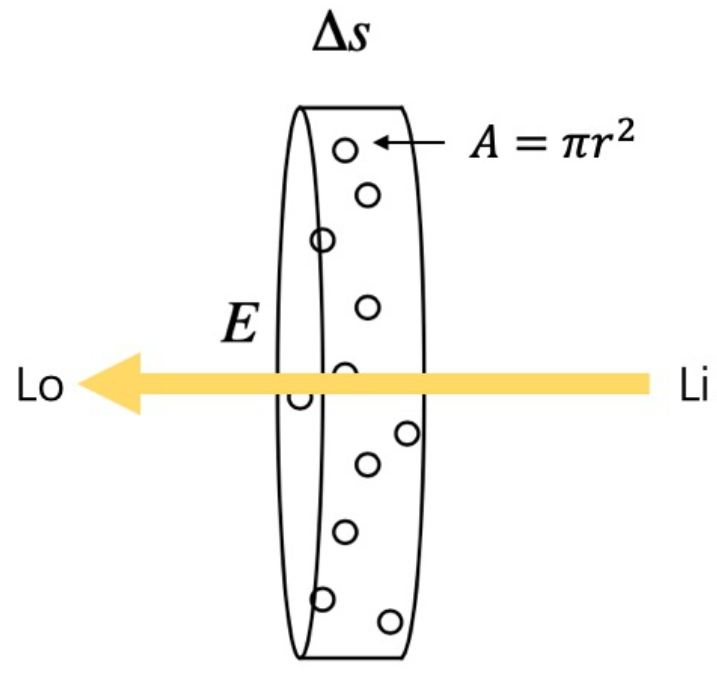

## Volume Rendering

体渲染把光子与粒子发生作用的过程，进一步细化为四种类型：

- 吸收 (absorption)：光子被粒子吸收，会导致入射光的辐射强度减弱

  

  假设例子的投影面积为 $A$，密度为 $\rho$，圆柱厚度为 $\Delta s$（很小，因此例子不会重叠），圆柱底面积为 $E$，因此光通过圆柱被遮挡的概率为：
  $$
  E\Delta s\rho A / E=\Delta s\rho A
  $$
  因此：
  $$
  \begin{align}
  & \Delta I=I_o-I_i=((1-\Delta s\rho A)-1)I_i=-\rho(s)AI(s)\Delta s\\
  & \frac{d I}{d s}=-\rho(s)AI(s)=-\tau_a(s)I(s)\\
  & I(s)=I_0\exp(-\int_0^s\tau_a(s)ds)
  \end{align}
  $$
  如果粒子群是均匀的，那么 $\tau_a$ 是常量，呈指数衰减，这称为比尔-朗伯吸收定律。

- 放射 (emission)：粒子本身可能发光，比如气体加热到一定程度就会离子化发光。这会进一步增大辐射强度

  假设单个例子发射一束光的辐射强度为 $I_e$，那么以这个点为发光源，我们同样可以得到：
  $$
  \begin{align}
  & \frac{d I}{d s}=\rho(s)AI_e(s)=\tau_a(s)I_e(s)\\
  \end{align}
  $$

- 外散射 (out-scattering)：光子在撞击到粒子后，可能会发生弹射，导致方向发生偏移，会减弱入射光强度

  同吸收一样，外散射对光线的削弱程度，也跟光学厚度相关，不过过程相对吸收来说又复杂一些，因此我们用 $\tau_s$ 来表示外散射对光线的削弱比例，以区别于 $\tau_a$。

  同样的，这一过程可以表示为：
  $$
  \frac{dI}{ds}=-\tau_s(s)I(s)
  $$

- 内散射 (in-scattering)：其他方向的光子在撞到粒子后，可能和当前方向上的光子重合，从而增强当前光路上的辐射强度

  假设来自其他光路的辐射强度为 $I_s$，那么同样地我们有：
  $$
  \frac{dI}{ds}=\tau_s(s)I_s(s)
  $$

因此，出射光和入射光之间的变化量，可以表示为这四个过程的叠加：
$$
L_o-L_i=dL(x,w)=emission+inscattering-outscattering-absorption
$$
其中 $x$ 表示光线上的某个位置点，$w$ 表示光线发射的方向。

因此，体渲染方程为：
$$
\begin{align}
& \frac{dI}{ds}=-\tau_a(s)I(s)+\tau_a(s)I_e(s)-\tau_s(s)I(s)+\tau_s(s)I_s(s)\\
\end{align}
$$
NeRF 中忽略了 Scattering，因此变为：
$$
\begin{align}
& \frac{dI}{ds}=-\tau_a(s)I(s)+\tau_a(s)I_e(s)\\
& \\
& for\ y'(x)+p(x)y(x)=q(x)\\
& assume\ that\ (uy)'=g\\
& \int(uy)'dx=\int gdx\\
& uy=\int gdx +C\\
& y(x)=\frac{\int g(x)dx +C}{u(x)}\\
& (uy)'=uy'+u'y=g\\
& y'+\frac{u'}{u}y=\frac{g}{u}\\
& let\ p=\frac{u'}{u},\ then\ u=e^{\int p}\\
& let\ q=\frac{g}{u},\ then\ g=qe^{\int p}\\
& \\
& \therefore y(x)=\frac{\int g(x)dx +C}{u(x)}=\frac{\int^x q(t)e^{\int^t p(t')dt'}dt +C}{e^{\int^x p(t)dt}}\\
& =\int^x q(t)e^{\int^t p(t')dt'}dt\cdot e^{-\int^x p(t)dt} +Ce^{-\int^x p(t)dt}\\
& =\int^x q(t)e^{\int^t p(t')dt'}e^{-\int^x p(t)dt}dt +Ce^{-\int^x p(t)dt}\\
& =\int_0^x q(t)e^{-\int_t^x p(t')dt'}dt +Ce^{-\int_0^x p(t)dt}\\
& \\
& \because p(x)=\tau_a(x),\ q(x)=\tau_a(x)I_e(x)\\
& \therefore y(x)=\int_0^x\tau_a(t)I_e(t)e^{-\int_t^x\tau_a(t')dt'}dt+I_0e^{-\int_0^x\tau_a(t)dt}
\end{align}
$$

这里可以理解为：$I_0$ 是最边界处的颜色，$e^{-\int_0^x\tau_a(t)dt}$ 是衰减项，$I_e$ 是光路中一个点的发光项，$\tau_a$ 是那个地方的稠密程度。现在所在的参考系是边界所在的参考系，如果以相机为参考系，那么方程为：
$$
\begin{align}
& y(x)=\int_0^x\tau_a(t)I_e(t)e^{-\int_0^t\tau_a(t')dt'}dt+I_0e^{-\int_0^x\tau_a(t)dt}\\
& =\int_0^x\sigma(t)C(t)T(t)dt+I_0T(x)\\
& where\ T(x)=e^{-\int_0^x\tau_a(t)dt}
\end{align}
$$
在计算机中采用分段相加的形式来近似这个积分：
$$
\begin{align}
& I(t_n\rightarrow t_{n+1})=\int_{t_n}^{t_{n+1}}T(t)\sigma(t)C(t) dt
\end{align}
$$
不妨假设这一小段内稠密度和颜色都是一致的：
$$
\begin{align}
& I(t_n\rightarrow t_{n+1})=\sigma_nC_n\int_{t_n}^{t_{n+1}}T(t) dt
\end{align}
$$
又因为：
$$
\begin{align}
& T(t)=e^{-\int_0^t\tau_a(t')dt'}\\
& =e^{-[\int_0^{t_n}\tau_a(t')dt'+\int_{t_n}^t\tau_a(t')dt']}\\
& =e^{-\int_0^{t_n}\tau_a(t')dt'}\cdot e^{-\int_{t_n}^t\tau_a(t')dt'}\\
& =T(0\rightarrow t_n)T(t_n\rightarrow t)\\
\end{align}
$$
因此：
$$
\begin{align}
& I(t_n\rightarrow t_{n+1})=\sigma_nC_n\int_{t_n}^{t_{n+1}}T(t) dt\\
& =\sigma_nC_n\int_{t_n}^{t_{n+1}}T(0\rightarrow t_n)T(t_n\rightarrow t) dt\\
& =\sigma_nC_n T(0\rightarrow t_n)\int_{t_n}^{t_{n+1}}T(t_n\rightarrow t) dt\\
& =\sigma_nC_n T(0\rightarrow t_n)\int_{t_n}^{t_{n+1}}e^{-\int_{t_n}^t\tau_a(u)du} dt\\
& =\sigma_nC_n T(0\rightarrow t_n)\int_{t_n}^{t_{n+1}}e^{-\sigma_n(t-t_n)} dt\\
& =T(0\rightarrow t_n)C_n(1-e^{-\sigma_n(t_{n+1}-t_{n})})
\end{align}
$$
最后所有段相加：
$$
\begin{align}
& I(s)=\Sigma_{n=1}^NI(t_n\rightarrow t_{n+1})+T(s)I_0\\
& =\Sigma_{n=1}^NT(0\rightarrow t_n)C_n(1-e^{-\sigma_n(t_{n+1}-t_{n})})+T(s)I_0\\
& let\ \delta_n=t_{n+1}-t_n\\
& I(s)=\Sigma_{n=1}^NT_nC_n(1-e^{-\sigma_n\delta_n})+T(s)I_0\\
& where\ T_n=e^{-\int_0^{t_n}\sigma_udu}\approx e^{\Sigma_{k=1}^{n}-\sigma_k\delta_k}
\end{align}
$$
